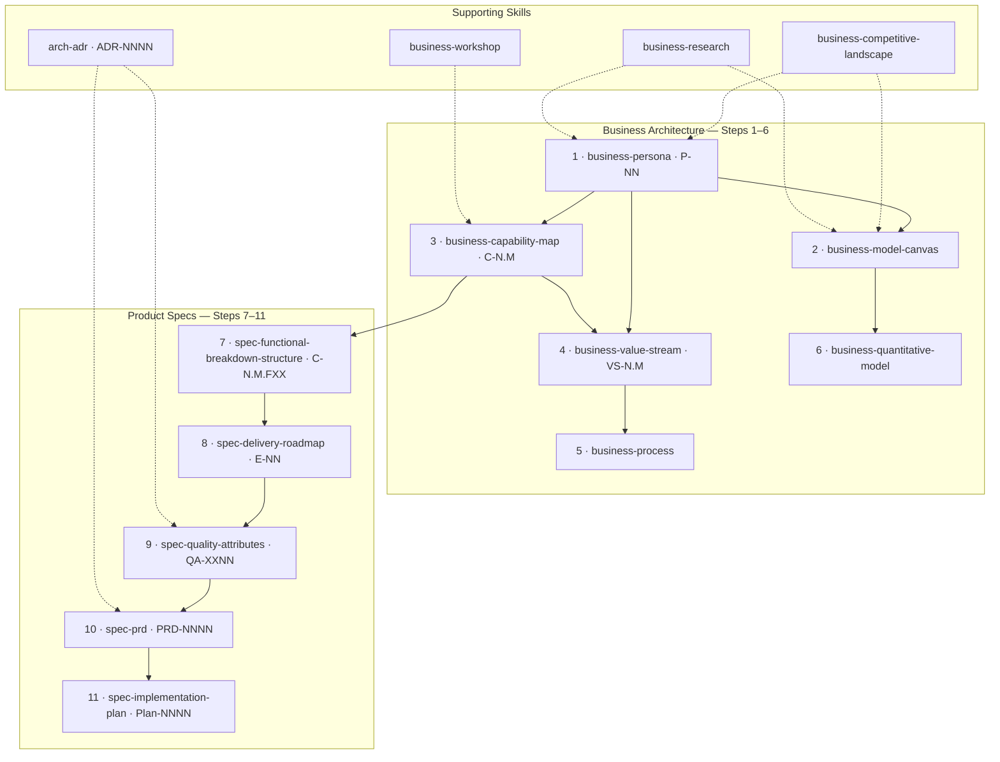
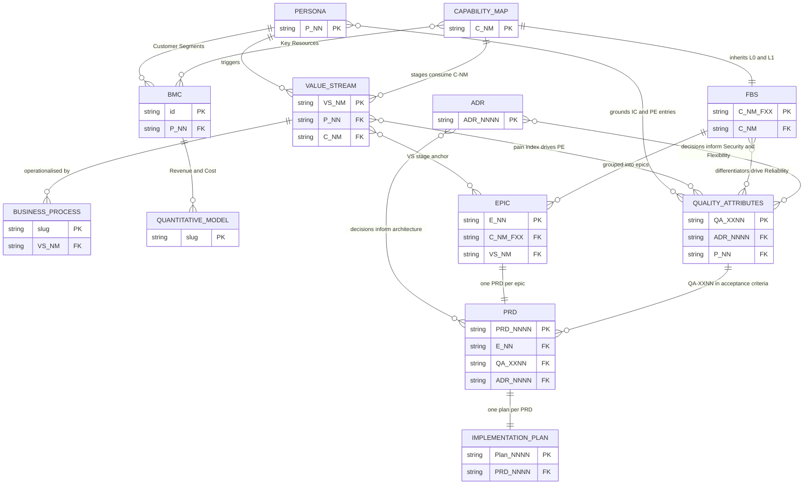

# homemade-claude-kit

A personal Claude Code toolkit that implements a complete **strategic-architecture documentation system** — from business personas through implementation plans — using composable skills governed by a shared metamodel.

Every skill produces a named artefact with a stable ID. Artefacts cross-link by those IDs. The result is a traceable, auditable documentation stack for any software product or venture.

> **Metamodel:** [`rules/metamodel.md`](./rules/metamodel.md) — canonical artefact definitions, DAG, ID conventions, and build order.

---

## The artefact system

11 artefacts in two layers, built in order. Solid arrows = hard dependency. Dashed arrows = supporting skills that validate or enrich without blocking.



---

## Data relationships

Each artefact **mints** a primary ID and **consumes** upstream IDs as cross-references. Relationship labels show which ID flows between artefacts.



---

## Skill index

| Prefix | Skill | Output | ID minted |
|---|---|---|---|
| `business-` | `business-persona` | `docs/business/personas/personas.md` | `P-NN` |
| `business-` | `business-capability-map` | `docs/business/capability-map/capability-map.md` | `C-N.M` |
| `business-` | `business-value-stream` | `docs/business/value-streams/value-streams.md` | `VS-N` · `VS-N.M` |
| `business-` | `business-process` | `docs/business/processes/{slug}-process.md` | slug |
| `business-` | `business-model-canvas` | `docs/business/business-model-canvas/` | block IDs |
| `business-` | `business-quantitative-model` | `docs/business/models/{slug}.md` | slug |
| `business-` | `business-competitive-landscape` | `docs/business/competitive-landscape/` | — |
| `business-` | `business-research` | `docs/business/research/` | — |
| `business-` | `business-workshop` | `docs/business/workshops/` | — |
| `spec-` | `spec-functional-breakdown-structure` | `docs/product-specs/functional-breakdown-structure/FBS.md` | `C-N.M.FXX` |
| `spec-` | `spec-delivery-roadmap` | `docs/product-specs/delivery-roadmap.md` | `E-NN` |
| `spec-` | `spec-quality-attributes` | `docs/product-specs/quality-attributes/quality-attributes.md` | `QA-XXNN` |
| `spec-` | `spec-prd` | `docs/product-specs/{NNNN}_prd_{feature}.md` | `PRD-NNNN` |
| `spec-` | `spec-implementation-plan` | `docs/exec-plans/active/{NNNN}_{slug}/` | `Plan-NNNN` |
| `spec-` | `spec-idea` | `docs/ideas/{slug}.md` | — |
| `spec-` | `spec-peer-review` | review report | — |
| `arch-` | `arch-adr` | `docs/architecture/decisions/{NNNN}-{slug}.md` | `ADR-NNNN` |
| `ops-` | `ops-runbook` | `docs/ops/runbooks/{slug}.md` | — |
| `ops-` | `ops-bug-rca` | `docs/ops/rcas/{date}-{slug}.md` | — |
| `dev-` | `dev-git-commit` | git commit | — |
| `dev-` | `dev-pr` | GitHub pull request | — |
| `dev-` | `dev-git-worktree` | git worktree | — |
| `dev-` | `dev-ralph-loop` | autonomous increment execution | — |
| `dev-` | `dev-slide-deck` | HTML slide deck | — |
| `util-` | `util-metamodel-audit` | `var/reports/metamodel-audit/` | — |
| `util-` | `util-docs-audit` | doc health report | — |
| `util-` | `util-toolkit-doctor` | setup health report | — |

---

## Install

```bash
# Clone once
git clone git@github.com:VictorHueni/homemade-claude-kit.git ~/projects/homemade-claude-kit

# Symlink everything globally (~/.claude/skills/ + ~/.claude/commands/ + ~/.claude/rules/)
./install.sh
```

## Update

```bash
cd ~/projects/homemade-claude-kit
git pull
# Symlinks already point here — done.
```

## Adding a skill

1. Create `{skill-name}/SKILL.md` following the naming convention in [`rules/skill-creation-sync.md`](./rules/skill-creation-sync.md)
2. Run `./install.sh` to symlink it
3. Register it in [`rules/metamodel.md`](./rules/metamodel.md) if it produces a metamodel artefact
4. Commit and push
