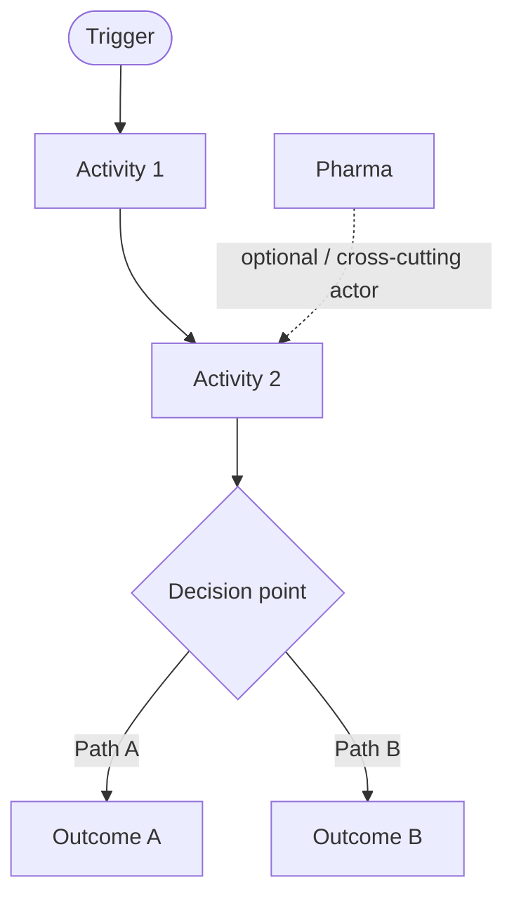
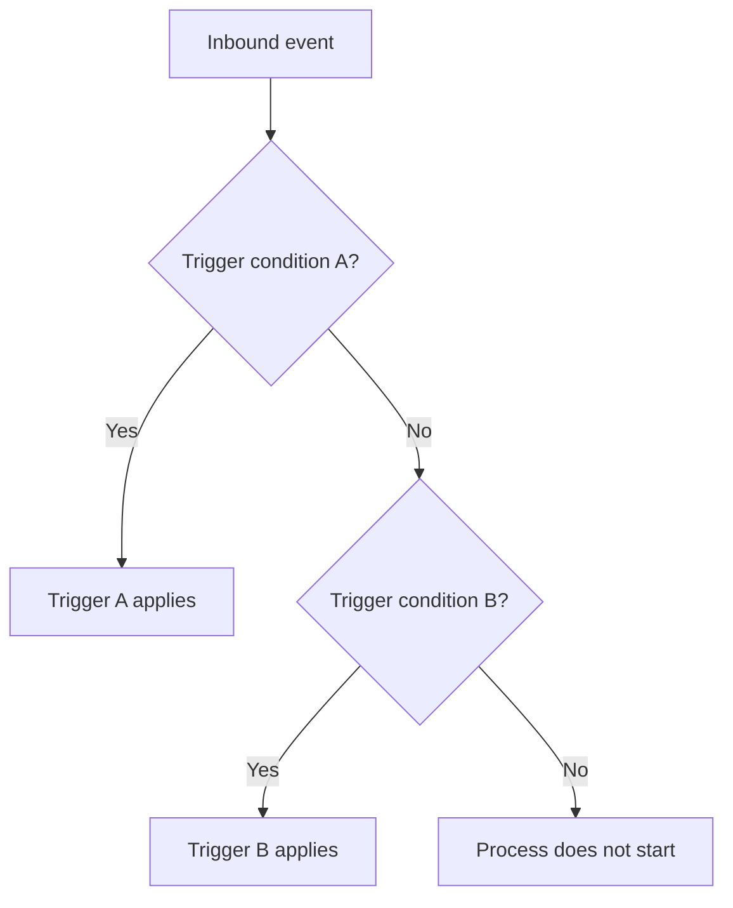
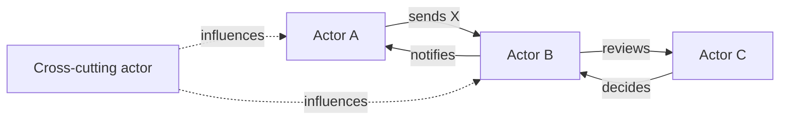
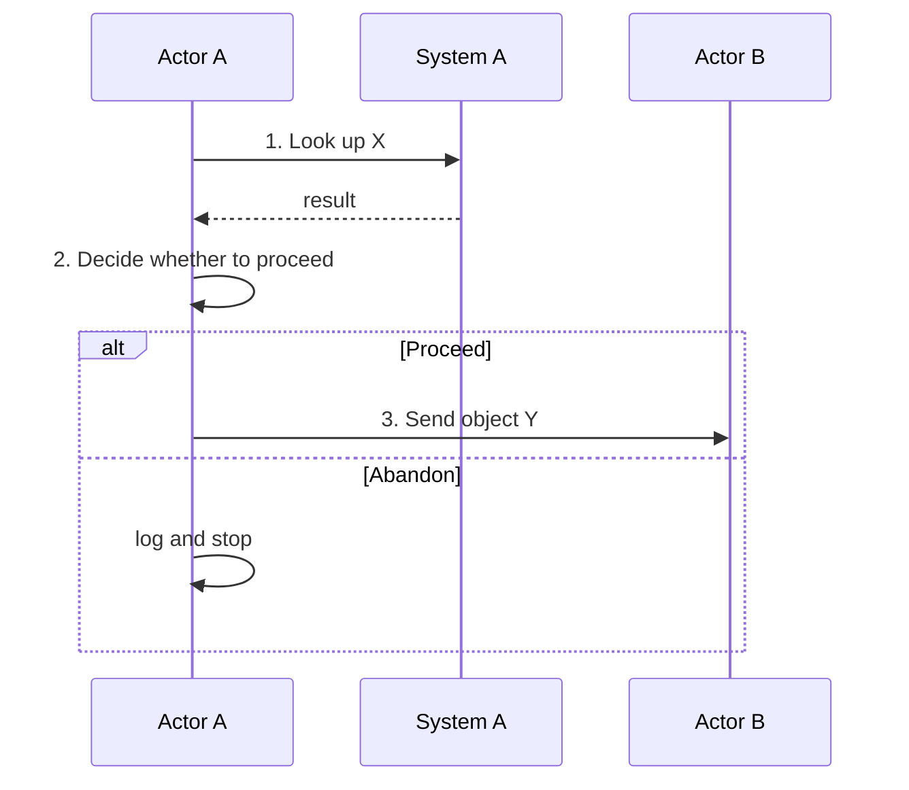
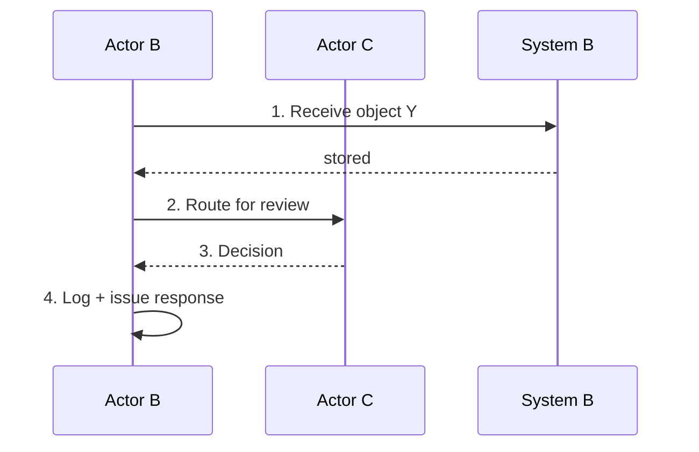

<!-- doc-version: 1.0 | created: YYYY-MM-DD -->

# {Process Display Name}

**Audience:** {internal technical reference / audit-facing / investor-facing — default: internal technical reference}. Telegraphic style. Every claim cites a legal article or a primary source.

**Type:** Descriptive operator-grade reference. This doc says **what happens**, not what should change. Strategic argument belongs in a companion analysis doc; quantification belongs in a model doc.

**Companion docs:**
- {Link to strategic analysis if one exists}
- {Link to quantitative model if one exists}
- {Link to upstream process(es) — what feeds this}
- {Link to downstream process(es) — what consumes this}

**Glossary:** {Link to project glossary if one exists}

---

## 0. Master flow — one diagram

**Key principle:** {one-sentence framing of the process's fundamental shape — e.g., "This is a prior-approval workflow — treatment cannot proceed without an upstream decision" / "This is a post-hoc verification workflow — the check happens after the transaction" / "This is a continuous monitoring loop — no defined end state"}.

---

## 1. What this process is

**{Process name}** ({translation if multilingual}) is {one-sentence definition}.

{2–3 paragraphs of descriptive frame: what the process accomplishes, when it applies, why it matters operationally. Avoid strategic argument here — that belongs in the analysis doc.}

**Scope:** {start point → end point — e.g., "Starts when a prescriber identifies a KG trigger; ends when the insurer reimburses or rejects the invoice"}.

**Out of scope:** {things people might assume are part of this process but aren't}.

---

## 2. Triggers — what starts this process

| Trigger | Source | Frequency | Decision criteria |
|---|---|---|---|
| {Trigger 1} | {Where the trigger comes from — system event, regulatory deadline, customer action} | {How often it fires — daily / per-transaction / on-demand} | {What determines whether this trigger applies} |
| {Trigger 2} | | | |
| {Trigger 3} | | | |

{If multiple triggers exist with branching logic, add a Mermaid decision tree:}

---

## 3. Actors — roles + responsibilities

| Actor | Role in this process | Authority | Decision rights | Statutory / contractual basis |
|---|---|---|---|---|
| {Actor 1, e.g. Prescriber} | {What they do in this flow} | {Granted by — license, contract, statute} | {Specific decisions they can make} | {Legal article or contract clause} |
| {Actor 2, e.g. Insurer intake} | | | | |
| {Actor 3, e.g. Medical advisor} | | | | |
| {Actor 4, e.g. Patient} | | | | |
| *Cross-cutting actor (e.g. Pharma)* | {Optional — actor that influences but doesn't own a step; document the influence pattern} | | | |

**Actor map** (a one-screen Mermaid showing actor relationships):

---

## 4. Data Stores — systems and registries involved

| System | Owner | Read by | Written by | Authoritative for | Format / API |
|---|---|---|---|---|---|
| {System 1, e.g. EHR / KIS} | {Owning organisation} | {Which actors read} | {Which actors write} | {What this system is the source of truth for} | {File format, API style, standards} |
| {System 2} | | | | | |
| {System 3} | | | | | |

{Add notes on system fragmentation if relevant — e.g., "There are ~10 KIS vendors in Switzerland; each has its own integration model."}

---

## 5. Data Objects — what flows through the process

| Object | Created by | Consumed by | Format | Required fields | Standards reference |
|---|---|---|---|---|---|
| {Object 1, e.g. Submission form} | {Actor / system} | {Actor / system} | {PDF / XML / JSON / paper} | {Patient ID, diagnosis, prior therapy, …} | {Form spec, XML schema, FHIR profile} |
| {Object 2, e.g. Decision letter} | | | | | |
| {Object 3, e.g. Invoice} | | | | | |

**Content vs. transport separation:** if relevant, explicitly distinguish:
- *Content* = what fields the object carries (the questions on the form / the message payload)
- *Transport* = how the object travels (mail / fax / XML message / FHIR Bundle / portal upload)

Conflating these is a common source of analysis errors.

---

## 6. Activities — step-by-step walkthrough

Each actor's flow gets its own subsection with a Mermaid sequence diagram + numbered steps.

### 6.1 {Actor A}'s flow

1. **{Step name}** — {what happens, with which data store, what's the outcome}
2. **{Step name}** — {…}
3. **{Step name}** — {…}

**Failure modes:** {what goes wrong at this stage — late inputs, missing data, ambiguous criteria}.

### 6.2 {Actor B}'s flow

1. **{Step name}** — {what happens}
2. {…}

### 6.3 {Cross-cutting flow}, if any

{For actors who influence the process but don't own a step — e.g., pharma support material, regulatory observer.}

---

## 7. Decision points + business rules

| Decision | Inputs | Rule | Outcome | Authority |
|---|---|---|---|---|
| {Decision 1, e.g. "is this request complete?"} | {Form fields populated yes/no} | {Specific completeness criteria — quote the statute if applicable} | {Complete → route to reviewer; incomplete → request additional data} | {Statutory article / contract clause / SOP} |
| {Decision 2, e.g. "approve or deny?"} | {Clinical evidence + criteria} | {Substantive rule} | {Approved / denied / pended} | {Statutory basis} |
| {Decision 3} | | | | |

**Decision-rule provenance:** for each rule, name where it comes from. Rules without provenance are tribal knowledge and a process-design risk.

---

## 8. KPIs — measurable indicators (MANDATORY)

| KPI | What it measures | Current value | Target / SLA | Owner | Source of measurement |
|---|---|---|---|---|---|
| {KPI 1, e.g. Time-to-decision (median)} | {How long from trigger to outcome} | {Number or `_TODO_`} | {Statutory / contractual target} | {Who owns the metric} | {Where it's measured — system log / audit table / manual} |
| {KPI 2, e.g. Approval rate} | {% of requests approved} | | | | |
| {KPI 3, e.g. First-pass completeness} | {% of requests complete on first submission} | | | | |
| {KPI 4, e.g. Statutory deadline compliance} | {% of decisions issued within deadline} | | | | |
| {KPI 5, e.g. Volume per unit time} | {Throughput} | | | | |

**Why these KPIs:** {one paragraph explaining what monitoring these together tells the operator — operational health vs. structural drift vs. compliance risk}.

> ⚠️ **If `current value` is `_TODO_`,** flag this as a row in §11 with the resolution path (typically: which system holds the measurement, who can extract it).

---

## 9. What's broken today — pain points

Operator-grade observations. Don't argue for a product solution here — that's the analysis doc's job. Just describe the pain points cleanly.

| Pain point | Who experiences it | Where in the process | Operational impact |
|---|---|---|---|
| {Pain point 1} | {Actor} | {Step or stage in §6} | {Concrete impact — time lost, error rate, financial risk} |
| {Pain point 2} | | | |
| {Pain point 3} | | | |

---

## 10. Sources

### 10.1 Primary regulatory / legal sources

| Source | Reference | What it provides |
|---|---|---|
| {Statute} | {Citation with link} | {What this source authoritatively defines} |
| {Ordinance} | | |

### 10.2 Professional society / stakeholder sources

| Source | Reference | What it provides |
|---|---|---|
| {Society publication} | | |

### 10.3 Industry / commercial sources

| Source | Reference | What it provides |
|---|---|---|
| {Industry report} | | |

### 10.4 Internal companion documents

| Doc | Why it matters |
|---|---|
| {Strategic analysis} | Strategic argument / product opportunity framing |
| {Quantitative model} | Quantification of this process's volume / impact |
| {Upstream process} | What feeds this one |
| {Downstream process} | What this one feeds |

---

## 11. Open TODOs

All flagged inline above; consolidated here for tracking.

| § | TODO | Resolution path | Priority |
|---|---|---|---|
| {§} | {What's missing or unverified} | {How to resolve — interview, observe, primary-source lookup, internal DB extract} | 🔴 / 🟡 / 🟢 |

---

## Changelog

### YYYY-MM-DD — Initial doc

{What this version covers, what's pre-filled vs. TODO, who contributed.}
