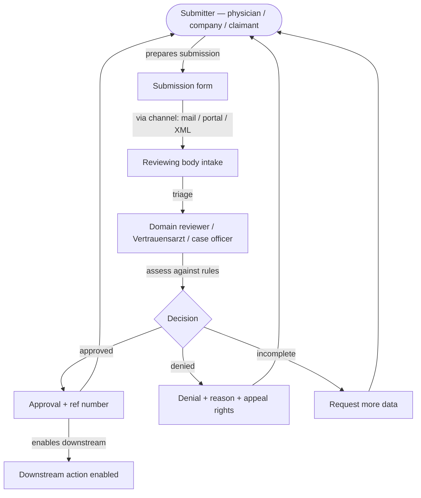
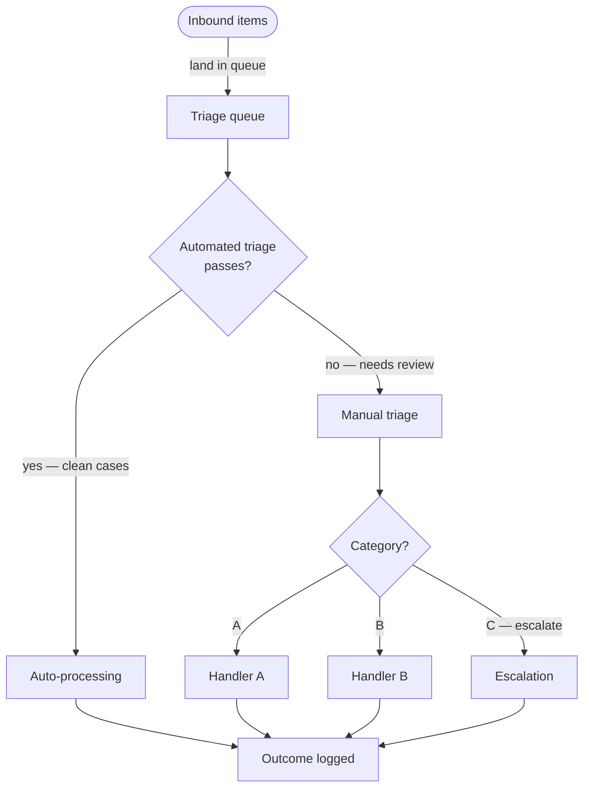

# Worked examples

Two concrete patterns showing how the canonical template gets filled. Use these as references when scaffolding a new process doc; copy structural patterns, not specific content.

---

## Example 1 — Regulatory submission process

**Process type:** workflow where an actor submits a request to a regulatory or insurer body, which then reviews and issues a decision. Examples: medical prior-authorisation (Kostengutsprache, US prior-auth, drug-listing applications), regulatory filings (Swissmedic submission, EMA submission), benefits eligibility determinations.

### What the §0 master diagram looks like

### Typical actors (§3)

| Actor | Role |
|---|---|
| Submitter | Prepares + submits the request |
| Reviewing body intake | Receives, triages, routes |
| Domain reviewer | Substantive review against rules |
| Statutory observer / appeals body | Optional — handles appeals |
| Cross-cutting: regulated entity (e.g. pharma) | May provide submission templates, evidence packages — influence without ownership |

### Typical KPIs (§8)

- **Time-to-decision (median, p90, p95)** — operational latency
- **Approval rate / Denial rate / Pend rate** — outcome mix
- **First-pass completeness rate** — quality of inbound submissions
- **Statutory deadline compliance rate** — regulatory exposure
- **Appeal rate + appeal-success rate** — decision-quality proxy
- **Volume + growth trend** — capacity exposure

### Common pain points (§9)

- "No deadline for incomplete requests" loophole — indefinite delay
- Form-content fragmentation (multiple authors, multiple variants per request type)
- Multiple submission channels (mail / fax / portal / email / XML) — no national standard
- Manual decision rubrics — inter-reviewer variance
- Decision opacity — appellants don't know what tipped the scale

### What to source from

- Federal statute + implementing ordinance for legal framework
- Professional-society publications for review rubrics and historical practice
- Industry / insurer publications for volume figures
- Patient-advocacy organisations for patient-side pain points

### Real-world reference

`docs/business/05a-processes/proc-NN-swiss-kostengutsprache.md` in the swiss-aos-drug-reimbursement-model project is the operator-grade implementation of this pattern.

---

## Example 2 — Back-office triage process

**Process type:** workflow where an inbound queue (invoices, claims, support tickets, applications) is triaged into categories, with each category routed to a different downstream handler. Examples: insurance claims processing, customer-support triage, regulatory reporting intake, security alert triage.

### What the §0 master diagram looks like

### Typical actors (§3)

| Actor | Role |
|---|---|
| Inbound source(s) | Where items come from |
| Triage system / engine | Automated first-pass categorisation |
| Triage operator | Manual review of items the engine couldn't categorise |
| Category-specific handlers | Each downstream handler is its own actor with its own rules |
| Quality / audit | Cross-cutting — reviews handler decisions retrospectively |

### Typical KPIs (§8)

- **Throughput per FTE** — capacity efficiency
- **Backlog age distribution** — queue health
- **Re-work rate** — % of items re-touched after initial processing
- **Auto-triage capture rate** — % handled without human touch
- **Manual-intervention rate** — inverse of auto-triage; trend over time
- **Cost per transaction** — economic efficiency
- **Decision reversal rate on audit** — quality proxy

### Common pain points (§9)

- Edge cases that the auto-triage engine miscategorises silently — surface only on audit
- Category boundaries that drift over time as inbound patterns evolve
- Handler-to-handler variance in decision quality
- Inability to retroactively re-route after initial categorisation
- Backlog accumulation during peak periods with no escalation mechanism

### What to source from

- Internal SOPs / handler manuals for category definitions
- System logs for KPIs (triage engine, ticketing system, claims platform)
- Quality-audit reports for decision-quality benchmarks
- Customer feedback for outcome-quality signals

---

## Common pattern variations

### Variation A — Bilateral / dialogue processes

The submission process (Example 1) is mostly unidirectional. Some processes have explicit back-and-forth between submitter and reviewer (medical second opinions, multi-round procurement). Handle by:

- §3 still per actor; emphasise communication channels in actor relationships
- §6 sequence diagrams show round-trips explicitly
- §7 decision points include "pause for more information" as an explicit outcome
- §8 KPIs include "round count" (how many back-and-forths before a final decision)

### Variation B — Stochastic / continuous processes

Some processes don't have discrete instances — they run continuously (monitoring, reconciliation, surveillance). Handle by:

- §1 explicitly states "no defined end state"
- §2 triggers become "ongoing — process is always running"
- §6 activities are described as ongoing duties of each actor, not numbered one-time steps
- §8 KPIs are the primary deliverable — what does "healthy" look like for this continuous process?

### Variation C — Multi-jurisdictional processes

When the same process runs differently in different jurisdictions (cantonal variation in CH, state variation in US, EU member-state variation), handle by:

- §3 actors gain a "jurisdictional variation" column
- §7 decision-rule provenance cites jurisdiction-specific sources
- Add a §3.1 cross-jurisdiction comparison table if variance is substantial
- The single master flow §0 should represent the common shape; jurisdictional variants belong in §6 subsections

---

## When you're stuck

If you can't fill a section, that itself is a finding. Common patterns:

| Stuck on | Likely root cause | Resolution |
|---|---|---|
| §3 Actors — can't list them clearly | The process spans multiple sub-processes that should be separate docs | Split into multiple process docs; this one becomes the orchestration layer |
| §4 Data Stores — can't name systems | The process is mostly informal / paper-based | Name the absence ("no canonical system; data lives in mailboxes + paper files") — that IS the finding |
| §5 Data Objects — too many to enumerate | You're conflating the process's data model with its instance traffic | Enumerate object *types*, not instances |
| §6 Activities — vague step descriptions | You skipped the §3+§4+§5 grounding | Go back to those sections; precisify the nouns first |
| §7 Decision rules — no provenance | The rules are tribal knowledge | Add a `doc-gap` row in §11 §Open Items naming the missing source + resolution path — the gap IS the finding |
| §8 KPIs — current values all `_TODO_` | The process isn't being measured | Seed the KPI list anyway; inline `_TODO_` placeholders are scaffold debt (audited by `util-metamodel-audit` Check 8), not §11 §Open Items rows — only add an §Open Items row when extracting the measurement is an actionable execution-item with a known resolution path |

The doc is **complete-enough-to-ship** when every section has either substantive content or an explicit inline `_TODO_` placeholder. Actionable unresolved work is captured in §11 §Open Items per the canonical schema (see [`rules/open-items-governance.md`](../../rules/open-items-governance.md)); a structural gap is incomplete; a clearly-marked unknown with a path forward is complete.
