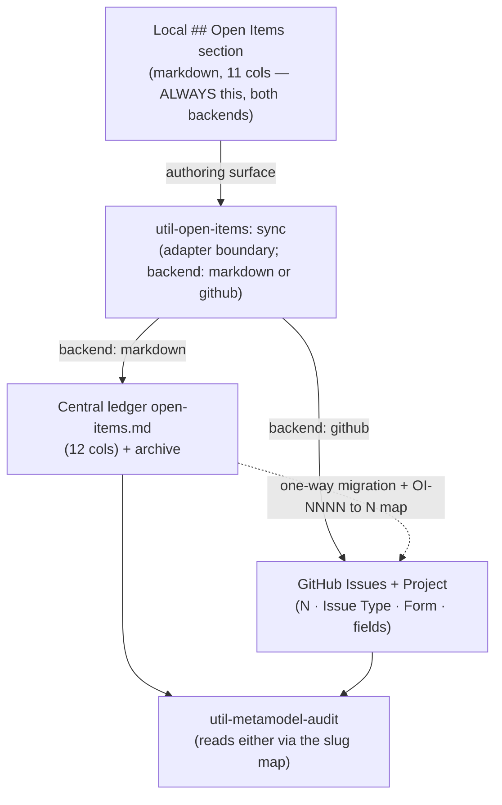
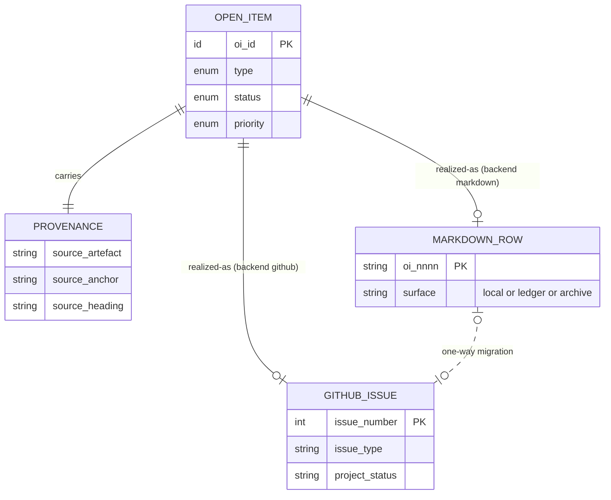

# Open Items — Backend Data Model & Interoperability Contract

This is the normative data model for the open-items central plane across **both** storage
backends (`markdown` and `github`). It expands the backend abstraction declared generically
in [`rules/open-items-governance.md`](../../../rules/open-items-governance.md) §5 with the
GitHub-specific mapping the kit repo uses, and it is the contract that `util-open-items`,
`util-metamodel-audit`, and the issue form (`.github/ISSUE_TEMPLATE/open-item.yml`) must
conform to.

**Authority boundary.** The governance rule remains the single source of truth for the
**taxonomy** (§2), **lifecycle** (§3), and **canonical schema** (§4). This document is the
single source of truth for **how that one model serializes into each backend** and **what
makes the two interoperable**. Where this document and the rule conflict on taxonomy /
lifecycle / schema, the rule wins; where they conflict on backend mapping, this document
wins.

**Scope.** Per [`adr-0002`](../../architecture/decisions/adr-0002-open-items-pluggable-backend-github-issues.md),
the `github` backend is adopted for the **kit repo only**. Other projects use the default
`markdown` backend. Whether to generalise `github` to the universal contract is the open
decision `OI-0030`.

---

## Layer 1 — The canonical entity (`OpenItem`)

The §4 schema abstracted away from any storage. Every field has a **stable slug**
(lower-snake). That slug — not the column header, not the form label — is the contract both
serializations bind to.

| Slug (contract key) | §4 column        | Type / domain                                                      | Required        | Notes                                                  |
| :------------------ | :--------------- | :----------------------------------------------------------------- | :-------------- | :----------------------------------------------------- |
| `oi_id`             | OI-ID            | identity                                                           | yes             | realized per backend (Layer 4b)                        |
| `type`              | Type             | enum: `doc-gap` · `decision-gap` · `execution-item` · `tech-debt`  | yes             | closed set (§2)                                        |
| `summary`           | Summary          | string (one self-contained sentence)                               | yes             |                                                        |
| `source_artefact`   | Source artefact  | repo-relative path \| scope marker \| empty                        | ledger/issue    | empty ⇒ central-only                                   |
| `source_anchor`     | Source anchor    | fragment (`#…`) \| empty                                           | yes\*           | empty ⇒ central-only                                   |
| `source_heading`    | Source heading   | string \| `_central-only_`                                         | yes             | `_central-only_` ⇒ no artefact home                    |
| `resolution_path`   | Resolution path  | string                                                             | yes             |                                                        |
| `priority`          | Priority         | enum: `low` · `medium` · `high` · `critical`                       | yes             |                                                        |
| `status`            | Status           | enum: `open` · `in-progress` · `blocked` · `closed` · `dropped`    | yes             | composite on `github` (Layer 4c)                       |
| `owner`             | Owner            | string \| `_TBD_`                                                  | yes             |                                                        |
| `review_date`       | Due / Review date| ISO-8601 date                                                      | yes             | closure date for terminal rows                         |
| `tracker_ref`       | Tracker ref      | URL \| `_TBD_`                                                     | yes             | must be non-`_TBD_` to enter `closed` / `dropped` (§3) |

\* `source_anchor` is required for artefact-originated items and empty for central-only items.

### Provenance shape

An `OpenItem` is exactly one of:

- **artefact-originated** — `source_artefact` = repo path, `source_anchor` = `#…`,
  `source_heading` = readable heading text.
- **central-only** — `source_heading` = `_central-only_`, `source_anchor` = empty,
  `source_artefact` = scope marker (owning folder/skill) or `(cross-cutting)`.

This distinction is identical in both backends and is never flagged as drift by the audit
(governance §5.2).

### Field partition (drives the GitHub mapping)

| Partition          | Fields                                                          | Markdown home | GitHub home                          |
| :----------------- | :------------------------------------------------------------- | :------------ | :----------------------------------- |
| **Authoring-time** | `type` · `summary` · `source_*` · `resolution_path` · `priority` | table columns | Issue Type · title · **Issue Form**  |
| **Lifecycle**      | `status` · `owner` · `review_date` · `tracker_ref` · `oi_id`    | table columns | native GitHub primitives             |

The partition is why GitHub closure is structurally enforced: lifecycle fields are never
hand-typed into a body — they are issue state, assignee, Project fields, and closing
references.

---

## Layer 2 — Markdown serialization

Three physical surfaces, one schema family.

| Surface          | Path                                                    | Columns                                              | Role               |
| :--------------- | :------------------------------------------------------ | :--------------------------------------------------- | :----------------- |
| **Local section**| inside each artefact, `## Open Items`                    | §4 **11 columns** (no `source_artefact`)             | authoring surface  |
| **Central ledger**| `docs/project-control/open-items/open-items.md`         | §5.1 **12 columns** (`source_artefact` after `summary`)| consolidated read-out |
| **Archive**      | `docs/project-control/open-items/archive/<YYYY-Q[1-4]>.md`| same 12 columns                                      | terminal-row history |

- **Identity:** `oi_id = OI-NNNN`, minted at first `sync`, monotonic across ledger + all
  archive files, never recycled.
- **Adapter:** `sync` reads an 11-column local row, injects `source_artefact` (= the file's
  repo path), writes a 12-column ledger row.

---

## Layer 3 — GitHub serialization

The local `## Open Items` section **stays markdown, identical to Layer 2** — only the
central read-out changes. One `OpenItem` ⇒ one **Issue**, projected into one **Project**.

| Canonical slug    | GitHub home                                        | Mechanism                                   |
| :---------------- | :------------------------------------------------- | :------------------------------------------ |
| `oi_id`           | Issue **number** `#N`                              | native; `OI-NNNN` retired in this backend   |
| `type`            | **Issue Type**                                     | 4 types map 1:1 to the taxonomy             |
| `summary`         | Issue **title**                                    |                                             |
| `source_artefact` | Issue Form field `source_artefact`                 | `input`                                     |
| `source_anchor`   | Issue Form field `source_anchor`                   | `input`                                     |
| `source_heading`  | Issue Form field `source_heading`                  | `input` (or `_central-only_`)               |
| `resolution_path` | Issue Form field `resolution_path`                 | `textarea`                                  |
| `priority`        | **Project** single-select field                    | sortable / groupable                        |
| `status`          | Issue state **+** Project Status field **+** close reason | composite (Layer 4c)                  |
| `owner`           | **Assignee**                                       | native                                      |
| `review_date`     | **Project** date field / Milestone                 |                                             |
| `tracker_ref`     | **Closing reference** (`Closes #N`, linked PR)     | native; unfakeable                          |
| read-out          | **Project (v2) board view**                        | replaces `report`-mode table                |
| archive           | **Closed issues** (searchable indefinitely)        | explicit `archive/` retired                 |

The **Issue Form** carries *only the authoring-time partition*; the lifecycle partition is
native GitHub. Closed issues are the archive, so the `archive` mode is a no-op under this
backend.

---

## Layer 4 — The interoperability contract

### 4a. Field-slug map (the single binding)

Both backends bind to the same slug set — markdown column headers **and** Issue-Form `id:`
keys. `util-metamodel-audit` reads either backend through this one map:

```text
oi_id · type · summary · source_artefact · source_anchor ·
source_heading · resolution_path · priority · status · owner ·
review_date · tracker_ref
```

**Invariant I1** — Issue-Form field `id:` ≡ canonical slug (e.g. `id: source_heading`, not
`id: heading`). This is what lets the audit parse an issue body the same way it parses a
ledger row.

### 4b. Identity translation — one-way, lossy, mapped

| Aspect   | `markdown`        | `github`              |
| :------- | :---------------- | :-------------------- |
| identity | `OI-NNNN` (minted)| `#N` (issue number)   |
| ID space | independent       | independent           |

**Invariant I2** — migration is **`markdown → github` only**, performed once at adoption,
and **must** emit a persisted `OI-NNNN → #N` map so existing back-references (artefact body
text; any `tracker_ref` pointing at an old `OI-ID`) can be rewritten. No bidirectional or
live sync — two writers over two ID spaces is the dual-source-of-truth anti-pattern. A
project runs **exactly one** backend.

### 4c. Status decomposition (the only composite field)

The single markdown `status` column fans out across three GitHub primitives:

| Canonical `status` | Issue state | Project Status field | Close reason   |
| :----------------- | :---------- | :------------------- | :------------- |
| `open`             | open        | (unset / "Open")     | —              |
| `in-progress`      | open        | "In progress"        | —              |
| `blocked`          | open        | "Blocked"            | —              |
| `closed`           | closed      | —                    | completed      |
| `dropped`          | closed      | —                    | **not planned**|

**Invariant I3** — `closed` / `dropped` require a non-`_TBD_` `tracker_ref`. On `github`
this is automatic (you close *via* a reference); on `markdown` it is validated by
`util-open-items`.

---

## Invariants summary

- **I1** — Issue-Form `id:` keys ≡ canonical slugs ≡ markdown column meanings. One field
  map, both backends.
- **I2** — Migration is one-way (`markdown → github`), once, with a persisted ID map; never
  concurrent. One backend per project.
- **I3** — Terminal status requires evidence (`tracker_ref`); native on `github`, validated
  on `markdown`.
- **I4** — The local `## Open Items` section is backend-invariant: always §4 markdown, so
  switching backends never touches authoring surfaces — only what `sync` writes to.
- **I5** — Provenance is the same composite in both backends; central-only items are
  `_central-only_` heading + empty anchor in both.

---

## Diagrams

### Adapter flow



### Entity realization



Each `OpenItem` is realized in **exactly one** backend per project; the two `realized-as`
relationships are mutually exclusive, enforced by the `backend:` setting, not by the schema.

---

## See also

- [`rules/open-items-governance.md`](../../../rules/open-items-governance.md) — canonical
  taxonomy, lifecycle, schema, and the generic backend abstraction.
- [`adr-0002`](../../architecture/decisions/adr-0002-open-items-pluggable-backend-github-issues.md) —
  the decision this model implements.
- [`open-items.md`](./open-items.md) — the live `markdown`-backend ledger.
- `util-open-items/SKILL.md` — ledger CRUD operating manual (gains the `backend:` setting).
