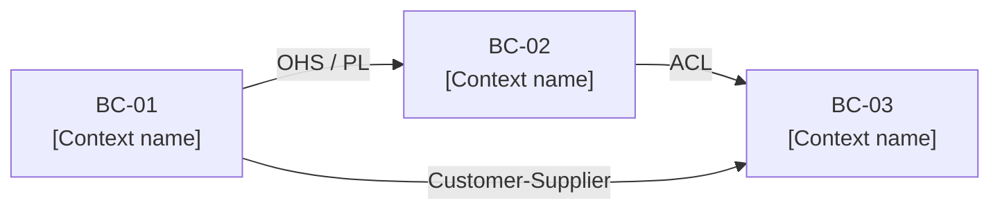

<!-- bc-map-version: 1.0 | created: {{YYYY-MM-DD}} -->

# {{product}} — Bounded Context Map

This document catalogues the bounded contexts for {{product}}: the named islands of consistent domain meaning, their subdomain classification, the capabilities they own, and the teams that should own them.

> **Methodology:** built using the canonical synthesis of [Evans DDD (2003) Chapter 14 + Vernon DDD Distilled (2016) Chapters 3–4 + Nick Tune Architecture Modernization (2024)](https://github.com/VictorHueni/homemade-claude-kit/tree/main/domain-bounded-context/references/methodology-references.md). The full bibliography lives with the skill that generated this doc — single source of truth across every project.

**Scope discipline:**
- A bounded context is where the domain model is consistent — where words have one precise meaning and one team is responsible for that meaning.
- Subdomain types: **Core** (competitive advantage; build and protect) · **Supporting** (enables Core; build or buy) · **Generic** (commodity; buy SaaS/OSS).
- See `context-map.md` for integration patterns between these contexts.

**Companion documents:**
- Capability map: [link to capability-map.md if exists]
- Context map: [context-map.md](./context-map.md)
- Domain glossary: [link to glossary.md if exists]
- Personas: [link to personas.md if exists]
- Value streams: [link to value-streams.md if exists]

---

## Subdomain catalogue

*One row per bounded context. Strategic importance drives build-vs-buy decisions downstream.*

| BC-NN | Name | Subdomain type | Strategic rationale | Team owner | Capabilities (C-N.M) |
|---|---|---|---|---|---|
| BC-01 | _TODO_ | Core / Supporting / Generic | _TODO_ | _TODO_ | _TODO_ |
| BC-02 | _TODO_ | Core / Supporting / Generic | _TODO_ | _TODO_ | _TODO_ |
| BC-03 | _TODO_ | Core / Supporting / Generic | _TODO_ | _TODO_ | _TODO_ |
| _(3–9 total)_ | | | | | |

---

## Bounded context definitions

### BC-01 · [Context name]

**Responsibility:** [1–2 sentence statement of what this context is responsible for — what domain problem it solves, what entities it owns, what decisions it makes.]

**Subdomain type:** **[Core | Supporting | Generic]**
**Rationale:** [One sentence: why this classification? E.g., "Core — this is where the business's pricing intelligence lives; no competitor replicates it the same way."]

**Capabilities owned:**
- [C-N.M](../../business/capability-map/capability-map.md#cNM) — [Capability name]
- [C-N.M](../../business/capability-map/capability-map.md#cNM) — [Capability name]
- _(Each capability appears in exactly one BC. No shared ownership.)_

**Ubiquitous language scope:**
- *[Term]* means [precise definition within this context] → see [glossary.md#bc-01](../glossary/glossary.md#bc-01)
- _(List the 2–5 most important terms whose definition is specific to this context. Cross-context homonyms are especially important to call out.)_

**Canonical data owned:**
- [Entity or aggregate name]: [what fields/state this context owns exclusively]
- _(Ownership means: no other context writes this data. Others may read it via integration interfaces.)_

**Integration interfaces (how other contexts use this one):**
- Publishes: [event / API / published language artefact, if Open Host Service or Published Language pattern]
- Exposes: [synchronous query interface, if any]
- _(Leave blank if this context only consumes; fill "exposes" when this context is upstream.)_

**Team boundary recommendation:**
- [Which team (stream-aligned / platform / enabling / complicated-subsystem per Team Topologies) should own this context, and why.]
- [Cognitive load estimate: small (1 squad) / medium (1–2 squads) / large (consider splitting)]

---

### BC-02 · [Context name]

**Responsibility:** _TODO_

**Subdomain type:** **_TODO_**
**Rationale:** _TODO_

**Capabilities owned:**
- _TODO_

**Ubiquitous language scope:**
- _TODO_

**Canonical data owned:**
- _TODO_

**Integration interfaces:**
- _TODO_

**Team boundary recommendation:**
- _TODO_

---

### BC-03 · [Context name]

[Fill following the BC-01 pattern.]

---

## Changelog

| Date | Change | Author |
|---|---|---|
| {{YYYY-MM-DD}} | Initial scaffold | _TODO_ |

---
---

<!-- context-map-version: 1.0 | created: {{YYYY-MM-DD}} -->

# {{product}} — Context Map

This document maps the integration patterns between the bounded contexts defined in `bounded-contexts.md`. Every relationship names an Evans pattern — no anonymous "they call each other."

> **Methodology:** [Evans DDD (2003) Chapter 14 — eight integration patterns + Vernon DDD Distilled (2016) Chapter 4](https://github.com/VictorHueni/homemade-claude-kit/tree/main/domain-bounded-context/references/methodology-references.md).

**Integration patterns in use (Evans vocabulary):**
- **Shared Kernel** — two teams share a model subset; high coordination; bounded by a formal agreement.
- **Customer-Supplier** — upstream provides; downstream has formal influence on the upstream roadmap.
- **Conformist** — upstream doesn't serve downstream needs; downstream must accept the upstream model as-is.
- **Anti-Corruption Layer (ACL)** — downstream translates upstream model into its own; protects the downstream model.
- **Open Host Service (OHS)** — upstream publishes a well-defined protocol for multiple downstreams.
- **Published Language (PL)** — formally documented shared language (OpenAPI, Avro schema, etc.).
- **Separate Ways** — no integration; teams solve independently.
- **Big Ball of Mud** — legacy/uncontrolled integration; document to make it visible, then plan remediation.

---

## Overview

*Edge labels name the integration pattern (upstream → downstream direction). ACL is annotated on the downstream side. See relationship definitions below for full detail.*

---

## Relationship definitions

### BC-01 → BC-02 · [Pattern name]

**Upstream context:** BC-01 · [Name]
**Downstream context:** BC-02 · [Name]
**Integration pattern:** **[Open Host Service | Published Language | Customer-Supplier | Conformist | ACL | Shared Kernel | Separate Ways]**

*Evans definition: [One sentence from Evans defining this pattern.]*

**What crosses the boundary:**
- [Event / data / command / query that crosses from upstream to downstream]
- [Include field names if known; otherwise describe at concept level]

**Translation layer (ACL only):**
- [If ACL: describe the translation — what does the ACL convert from upstream model to downstream model? E.g., "Upstream uses `userId` (integer); downstream translates to `MemberId` (value object with validation)."]
- [If not ACL: leave this field blank or mark N/A.]

**Technical implementation hint:**
- [REST API call / domain event on message bus / shared database read / gRPC / GraphQL / etc.]
- [Note: this is a hint, not a constraint. The context map is semantics-first.]

**Coupling risk:** [Low | Medium | High]
[One sentence rationale: e.g., "High — BC-02 conforms to BC-01's model; any breaking change in BC-01 cascades immediately."]

---

### BC-02 → BC-03 · [Pattern name]

**Upstream context:** BC-02 · [Name]
**Downstream context:** BC-03 · [Name]
**Integration pattern:** _TODO_

**What crosses the boundary:**
- _TODO_

**Translation layer:**
- _TODO_

**Technical implementation hint:**
- _TODO_

**Coupling risk:** _TODO_

---

### BC-01 → BC-03 · [Pattern name]

[Fill following the BC-01 → BC-02 pattern.]

---

## Changelog

| Date | Change | Author |
|---|---|---|
| {{YYYY-MM-DD}} | Initial scaffold | _TODO_ |
