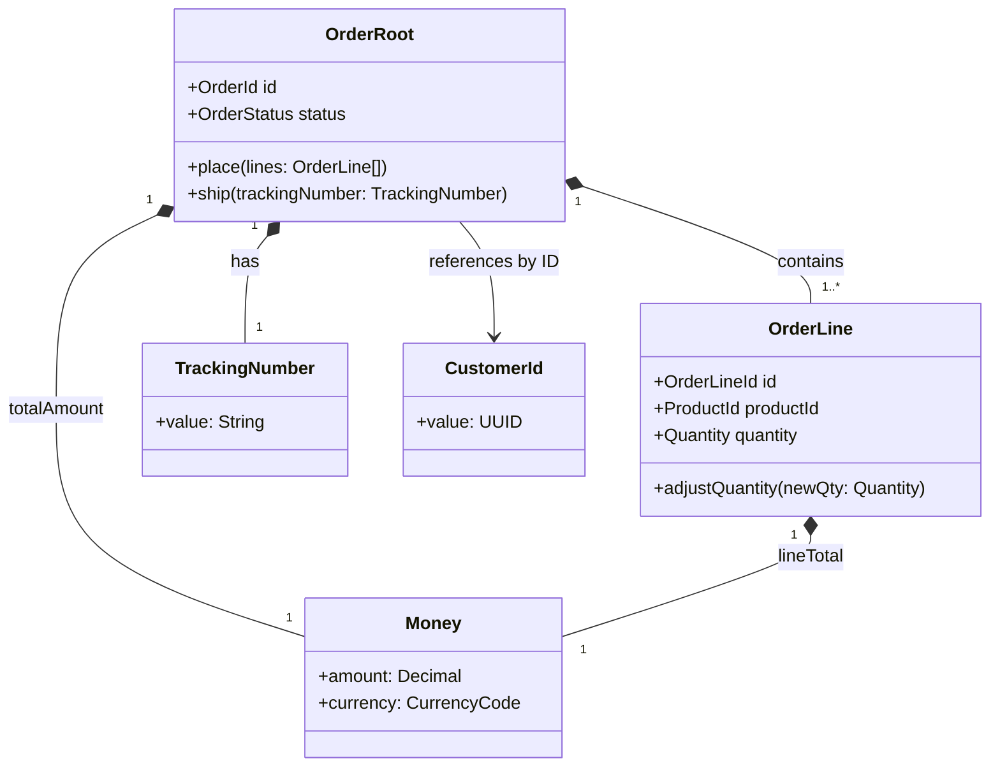

# Discipline Guide — Domain Model Builder

Internal guidance for Claude when executing the `domain-model` skill. Not delivered to users directly — used to inform model decisions during Fill, Verify, and Refactor modes.

---

## The 4 Vernon aggregate rules (apply at every Fill and Refactor)

Source: Vernon, *Implementing DDD* Chapter 10 + *DDD Distilled* Chapter 5.

### Rule 1 — Model a true invariant in a consistent boundary

An aggregate boundary exists for one reason: to enforce a business rule that must hold true after every command. Before finalising an aggregate, state its invariants explicitly in business language. If you cannot state at least two invariants, the boundary has no purpose.

Test: "What business rule would break if these objects were in separate aggregates and I updated them in separate transactions?"

- If the answer is "a specific named business rule" → the boundary is justified.
- If the answer is "nothing" → these objects do not belong in the same aggregate.

### Rule 2 — Design small aggregates

Start with one entity per aggregate. That entity is the root. Add a second entity only when you can answer yes to: "Must this entity's state change atomically with the root in the same transaction?"

Red flags for an aggregate that has grown too large:
- More than 5 entities in a single aggregate
- Commands that only touch one entity but load the entire aggregate
- Lock contention on the aggregate root during concurrent operations
- "I need to load the aggregate to check a field on one of its members"

Default position: when in doubt, keep objects in separate aggregates and use eventual consistency via domain events.

### Rule 3 — Reference other aggregates by identity

External aggregates are referenced by their root identity only — never by direct object reference. This is non-negotiable.

Wrong: `Order` holds a reference to `Customer` object.
Right: `Order` holds a `customerId` (of type `CustomerId` value object).

Why: holding a direct reference creates an implicit transaction boundary spanning both aggregates. It also loads the referenced aggregate whenever the referencing aggregate is loaded, creating coupling and performance problems.

Verification: scan each aggregate's attribute list for any field typed as another aggregate root. Every such field must be replaced with an ID value object.

### Rule 4 — Use eventual consistency outside the boundary

If a command on aggregate A must trigger a state change in aggregate B, the mechanism is:
1. Aggregate A raises a domain event when its command completes.
2. A domain event handler (policy, saga, or application service) reacts to the event and issues a command on aggregate B.
3. Aggregate B processes that command in its own separate transaction.

This means the two aggregates are eventually consistent, not immediately consistent. This is the intended design. If the business absolutely requires immediate consistency between two aggregates, that is a signal they may belong in the same aggregate — but verify Rule 1 first (is there actually a shared invariant?).

---

## Anemic model detection patterns

Use these checks during Mode 3 (Verify). Any match is a finding.

### Check 1 — Entity has only attribute documentation, no methods

Signal: entity section lists attributes but the "Behaviour methods" table is empty or contains only `get{X}()` and `set{X}()`.
Severity: critical (this is the primary symptom of an anemic domain model).
Proposed fix: identify the business operations this entity participates in (from process docs, FBS, or acceptance criteria) and model them as methods.

### Check 2 — All business logic attributed to service classes

Signal: the user mentions `*Service`, `*Manager`, `*Handler`, or `*Processor` classes that contain all the business rules, while domain objects have no logic.
Severity: critical.
Proposed fix: move the business rules that act on an entity's own data back into that entity.

### Check 3 — Entity cannot validate its own state

Signal: no validation invariants documented on any entity; all validation described as happening "in the service layer" or "in the application layer".
Severity: major.
Proposed fix: document the validation invariants that each entity enforces on its own attributes. Entities should reject invalid state at construction or mutation, not rely on external validators.

### Check 4 — Entity calls repositories or external services

Signal: behaviour methods reference querying a database, calling an API, or sending an email.
Severity: major (infrastructure leak into domain model).
Proposed fix: move the infrastructure call to the application service. The entity should receive what it needs via its method parameters or constructor.

---

## Invariant writing guide

Invariants are business rules that must hold true after every command. They are enforced by the aggregate root.

### Good invariants

State them in business language, not code. The rule must be falsifiable — there must be a condition under which it would be violated.

- "An Order cannot be Shipped unless it has at least one confirmed OrderLine."
- "A Claim cannot transition to Approved without a valid PolicyHolder reference in the same aggregate."
- "An Account balance cannot go below zero for standard accounts."
- "A Subscription cannot be activated if its end date is in the past."
- "A Contract must have exactly one primary signatory."

### Bad invariants (not actually invariants)

- "An Order has a status" — this is a field, not a rule.
- "Customer data is correct" — too vague; what does "correct" mean?
- "Entities are persisted" — infrastructure concern, not a domain invariant.
- "The system sends an email" — a side effect, not a consistency rule.

### Format

Write invariants as: "A {AggregateRoot} cannot {prohibited action} unless/without/until {condition}."

Or: "A {AggregateRoot} must {required state} when/after {trigger}."

---

## Domain event naming guide

Every domain event name must pass all four checks:

### Check 1 — Past tense

The event records something that already happened. It is not a command (present tense or imperative).

| Wrong (present / imperative) | Right (past tense) |
|---|---|
| `CreateOrder` | `OrderCreated` |
| `ApprovePayment` | `PaymentApproved` |
| `UpdateStatus` | `StatusUpdated` → (also fails Check 2, see below) |
| `SendNotification` | `NotificationSent` |
| `ProcessClaim` | `ClaimProcessed` |

### Check 2 — Business-meaningful

The name must convey a business fact that a domain expert would care about. Avoid generic state-change language.

| Wrong (generic / technical) | Right (business-meaningful) |
|---|---|
| `StatusUpdated` | `ClaimApproved`, `ClaimRejected`, `ClaimUnderReview` |
| `RecordModified` | `PolicyRenewed`, `PolicyCancelled` |
| `DataChanged` | `BeneficiaryAdded` |
| `EventOccurred` | `PaymentFailed` |

### Check 3 — Specific enough to act on

The event name should be specific enough that a consumer can decide whether to react without reading the payload.

- `OrderShipped` ✅ — a consumer knows this means the physical goods left the warehouse
- `OrderStatusChanged` ❌ — a consumer cannot know whether to react without reading the status field

### Check 4 — Noun phrase (not verb phrase)

Domain events are named as noun + past-participle verb pairs, not as verb phrases.

- `UserRegistered` ✅
- `Register` ❌
- `ClaimSubmitted` ✅
- `SubmittingClaim` ❌

---

## Aggregate vs Entity decision

Use this decision tree when classifying a new domain concept:

### Step 1 — Does this concept have a meaningful identity that persists across time and state changes?

"Would a domain expert say 'it's the same {Concept}, even though its state has changed'?"

- Yes → it is an **Entity** (Order exists before and after it is shipped; it is the same Order)
- No → it is a **Value Object** (a delivery address has no identity; two addresses with the same attributes are interchangeable)

### Step 2 (for entities) — Must this entity's state changes be consistent with another entity's state changes in the same transaction?

"If I updated these two entities in separate transactions, could I violate a business invariant?"

- Yes + there is a named invariant → they belong in the **same Aggregate**
- No → they belong in **separate Aggregates** (reference by ID, use eventual consistency)

### Value object signals

Strong signals that a concept is a value object (not an entity):
- It has no lifecycle of its own — it does not get created, updated over time, and deleted independently
- Replacing it with a new instance with the same attributes feels completely equivalent
- It is never the subject of a command in its own right
- Examples: `Money`, `Address`, `DateRange`, `Percentage`, `Coordinates`, `EmailAddress`, `PhoneNumber`, `OrderLineQuantity`

Strong signals that a concept is an entity (not a value object):
- It changes state over time and you need to track that history
- Domain experts refer to it by a name or identifier ("Claim #12345", "Order #ABC")
- Multiple users or systems may refer to the same instance simultaneously
- It can be the subject of commands in its own right

---

## Cross-aggregate consistency patterns (when to use which)

| Scenario | Pattern | Rationale |
|---|---|---|
| Two objects must change atomically (one transaction) and share an invariant | Same aggregate | Evans Rule 7 — invariant must hold after commit |
| Two objects must stay in sync but in separate aggregates | Domain event + eventual consistency | Vernon Rule 4 |
| One aggregate needs data from another to make a decision | Pass the needed data as a command parameter or value object | Avoid loading aggregate B inside aggregate A's method |
| A command affects multiple aggregates | Saga / process manager | Coordinates eventual consistency across multiple aggregates via domain events |

---

## Mermaid class diagram conventions

Use `classDiagram` for the domain model diagram.

Relationship notation:
- `*--` (composition): aggregate root to member entities and value objects
- `o--` (aggregation): not used in DDD model (no partial ownership)
- `-->` (reference by ID): from one aggregate root to another aggregate root (label with "by ID")
- `..>` (dependency): aggregate raising a domain event

Aggregate boundary: surround all members of an aggregate with a `note` or visually group by naming convention (prefix with aggregate name).

Example skeleton:

Always check that the diagram renders before delivering — the most common failure is using reserved Mermaid keywords as class names.
