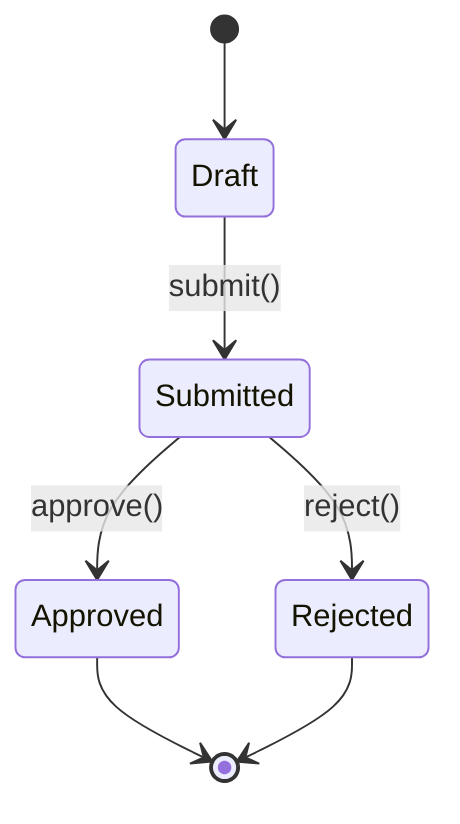

<!-- dm-version: 1.0 | bc: BC-NN | bc-name: {BC Name} | created: YYYY-MM-DD -->

# Domain Model — {BC-NN Name}

**Bounded context:** [BC-NN {Name}](../bounded-contexts.md#bc-nn)
**Subdomain type:** Core | Supporting | Generic
**Ubiquitous language:** [Glossary — {BC Name}](../glossary.md#bc-nn)

> "An aggregate is a cluster of associated objects that we treat as a unit for the purpose of data changes. Each aggregate has a root and a boundary." — Evans, *Domain-Driven Design* (2003), Chapter 8

---

## Aggregate catalogue

| ID | Name | Root entity | Member entities | Member VOs | Invariant count | Domain events |
|---|---|---|---|---|---|---|
| BC-NN.AGG-01 | {AggregateName} | {RootEntity} · BC-NN.ENT-01 | _TODO_ | _TODO_ | _TODO_ | _TODO_ |

---

## Aggregates

### {AggregateName} · BC-NN.AGG-01

**Root:** {RootEntityName} (BC-NN.ENT-01)
**Responsibility:** _TODO_ — one sentence stating what consistency rule this aggregate enforces

**Invariants:**
- INV-1: _TODO_ — [business rule that must always hold, e.g. "A Claim cannot be Approved without a verified PolicyHolder"]
- INV-2: _TODO_

**Lifecycle states:**



**Commands → Events:**

| Command | Precondition | Domain Event |
|---|---|---|
| _TODO_ | _TODO_ | _TODO_ (BC-NN.EVT-NN) |

**Member entities:**
- BC-NN.ENT-01 {EntityName} (root)
- _TODO_

**Member value objects:**
- BC-NN.VO-01 {ValueObjectName}
- _TODO_

**Consistency boundary rationale:** _TODO_ — why these objects must change together in the same transaction

**Size check:** _TODO_ entities — ≤5 ✅ | >5 flag for review ⚠️

---

## Entity catalogue

### {EntityName} · BC-NN.ENT-01

**Glossary term:** BC-NN.GT-NN
**Aggregate:** BC-NN.AGG-NN ({AggregateName})

**Identity:** _TODO_ — what makes this entity unique across time and state changes (e.g. "claimId assigned at submission; immutable thereafter")

**Key attributes:** (domain-meaningful only — no DB columns, no API fields)

| Attribute | Type | Business meaning |
|---|---|---|
| _TODO_ | _TODO_ | _TODO_ |

**Behaviour methods:** (what this entity CAN DO — not getters or setters)

| Method | Parameters | What it does + invariant enforced |
|---|---|---|
| _TODO_ | _TODO_ | _TODO_ |

**Lifecycle:** Created on _TODO_ → mutated by _TODO_ → archived/deleted when _TODO_

---

## Value object catalogue

### {ValueObjectName} · BC-NN.VO-01

**Glossary term:** BC-NN.GT-NN
**Aggregate:** BC-NN.AGG-NN ({AggregateName})

**Attributes:** (all immutable)
- `{attribute}`: {type} — {business meaning}

**Equality:** equal when all attributes are equal (no identity comparison)

**Validation invariants:** (enforced at construction — invalid state cannot be created)
- _TODO_ — e.g. "Amount must be > 0", "DateRange end must be after start"

**Replace-not-mutate:** confirmed — always replaced as a whole; never mutated in place

---

## Domain event catalogue

### {EventName} · BC-NN.EVT-01

**Naming check:** past tense ✅ | business-meaningful ✅
**Raised by aggregate:** BC-NN.AGG-NN ({AggregateName})

**Trigger:** _TODO_ — which command or external input causes this event to be raised

**Payload:**

| Field | Type | Why consumers need this |
|---|---|---|
| _TODO_ | _TODO_ | _TODO_ |

**Consumers:**
- [BC-NN internal]: _TODO_ — which aggregate or policy reacts and how
- [BC-MM external]: _TODO_ — cross-context consumer if applicable; otherwise remove this row

**Business significance:** _TODO_ — why a domain expert (non-technical) cares that this happened

---

## Class diagram

```mermaid
classDiagram
    class {AggregateName}Root {
        +{RootId} id
        +{State} status
        +submit()
        +approve()
    }
    class {MemberEntity} {
        +{EntityId} id
        +{attribute} value
        +{behaviourMethod}()
    }
    class {ValueObject} {
        +{attribute1} : Type
        +{attribute2} : Type
    }

    {AggregateName}Root "1" *-- "0..*" {MemberEntity} : contains
    {AggregateName}Root "1" *-- "1" {ValueObject} : has
```

---

## Changelog

| Date | Author | Change |
|---|---|---|
| YYYY-MM-DD | _TODO_ | Initial scaffold |
