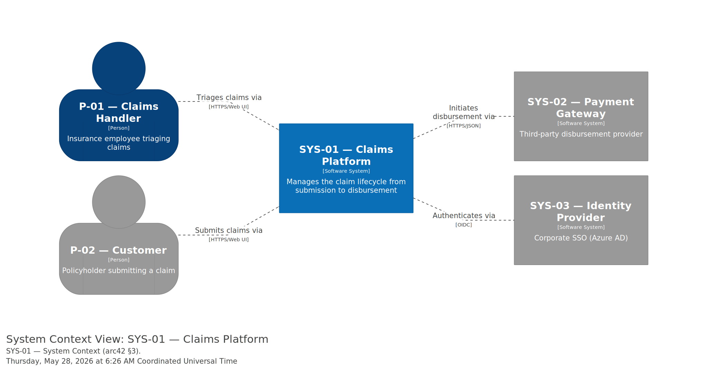

# 3. Context and Scope

> "Context and scope delimits your system from all its communication partners (neighbouring systems and users). It thereby specifies the external interfaces." — arc42 §3

This section documents the **black-box** view of Claims Platform: who and what it talks to. Internal containers and components belong to [§5 Building Block View](./05-building-blocks.md).

## 3.1 Business Context

The diagram below shows Claims Platform (SYS-01) and every communication partner. Black-box treatment — internals are hidden.

### Communication partners

| Partner | Inputs (from us) | Outputs (to us) |
|---|---|---|
| P-01 Claims Handler | Claim triage UI; assessment forms; approval/rejection controls | Triage decisions; assessment notes; approval rulings |
| P-02 Customer | Submission UI; status updates; payment-status notifications | New claim submissions; supporting documents; questionnaires |
| SYS-02 Payment Gateway | Disbursement instructions (claim ID, amount, beneficiary IBAN) | Disbursement confirmations; transaction IDs; failure reasons |
| SYS-03 Identity Provider | OIDC auth requests (client_id, scopes) | ID tokens; access tokens; user profile claims |

### Notable domain interactions

- **Disbursement (SYS-02):** Claims Platform initiates the transfer but does not hold customer payment data — the IBAN and KYC info are owned by Payment Gateway and only referenced by tokenised account IDs.
- **Authentication (SYS-03):** all interactive sessions go through Azure AD. Service-to-service calls inside the system use mutual TLS, not OIDC.

## 3.2 Technical Context

Channels and protocols between Claims Platform and its partners. Derived from the `technology` field on each Structurizr DSL relationship.

| Partner | Channel | Protocol | Format | Notes |
|---|---|---|---|---|
| P-01 Claims Handler | HTTPS/Web UI | HTTPS over TLS 1.3 | HTML + JSON XHR | Browser-based; session cookies set by SYS-03 OIDC flow |
| P-02 Customer | HTTPS/Web UI | HTTPS over TLS 1.3 | HTML + JSON XHR | Same browser channel as Claims Handler; different role + permissions |
| SYS-02 Payment Gateway | HTTPS/JSON | HTTPS over TLS 1.3 | JSON request/response | Outbound; we are the client |
| SYS-03 Identity Provider | OIDC | HTTPS + OIDC token flow | JWT tokens | Both interactive (auth code + PKCE) and service-to-service (client credentials) flows |

### Mapping input/output to channels

- All actor inputs/outputs travel over the HTTPS/Web UI channel.
- Disbursement-related inputs/outputs travel over the HTTPS/JSON channel to SYS-02.
- Authentication/authorisation is OIDC throughout — the same channel carries inputs (auth requests) and outputs (tokens).

## Cross-references

| Linked artefact | Relationship |
|---|---|
| [`docs/business/01a-personas.md`](../../business/01a-personas.md) | Persona definitions (`P-NN`) reused as actors here |
| [`docs/domain/02b-bounded-contexts.md`](../../domain/02b-bounded-contexts.md) | External SaaS in the BC map's `Generic` subdomains often appear here as external systems |
| [`docs/architecture/interfaces/`](../interfaces/) | Service contracts (`CTR-NN`) define the wire formats for partners |
| [`docs/architecture/arc42/05-building-blocks.md`](./05-building-blocks.md) | What's *inside* the black box drawn above |

## Open Items

| OI-ID | Type | Summary | Source anchor | Source heading | Resolution path | Priority | Status | Owner | Due / Review date | Tracker ref |
| :---- | :--- | :------ | :------------ | :------------- | :-------------- | :------- | :----- | :---- | :---------------- | :---------- |
| OI-001 | doc-gap | Personas in this demo are placeholders; real Tier-1 personas need `business-persona` to run first | #partners | Communication partners | Run `business-persona` for Claims Handler + Customer | medium | open | kit-demo | _TBD_ | _TBD_ |

(Schema follows the kit's Open Items Governance contract: every row is one of `doc-gap` / `decision-gap` / `execution-item` / `tech-debt`. Sync to [`docs/project-control/open-items/`](../../project-control/open-items/) via the `util-open-items` skill.)
