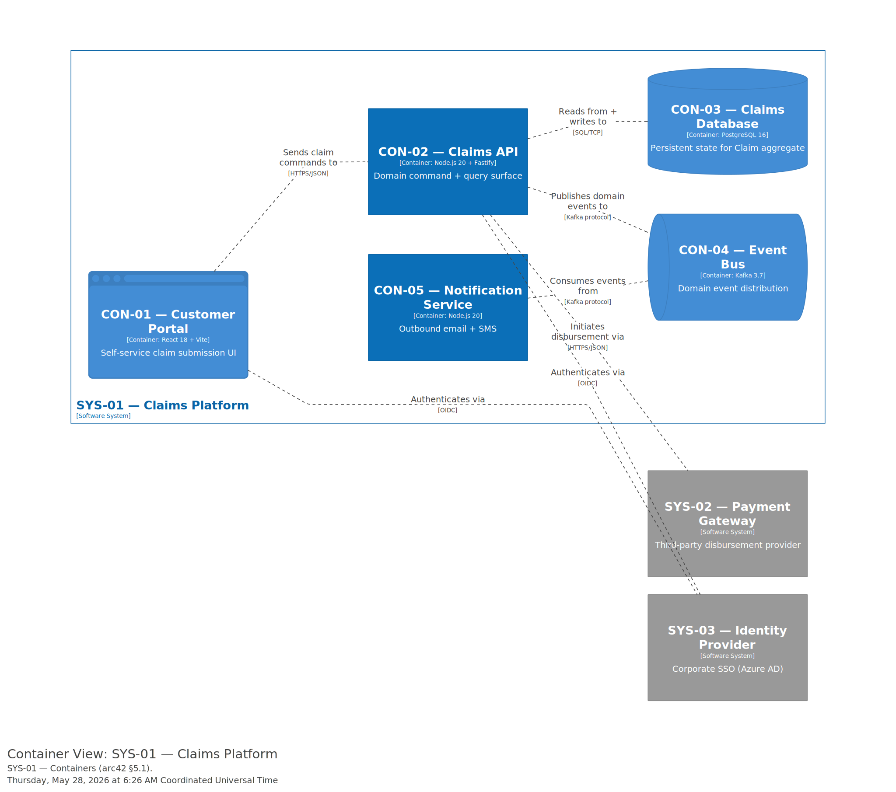
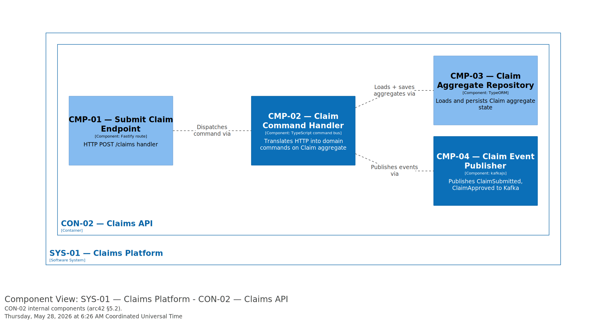

# 5. Building Block View

> "The building block view shows the **static** decomposition of the system into building blocks … as well as their dependencies. This view is mandatory for every architecture documentation. In analogy to a house this is the *floor plan*." — arc42 §5

The Building Block View is **structural**. Behaviour and time-ordered scenarios belong to [§6 Runtime View](./06-runtime-view.md). Aggregate invariants, lifecycle state machines, and command-event listings belong to [`docs/domain/07b-models/`](../../domain/07b-models/) — this section names containers and components and **links back** to the domain model, never re-states it.

## 5.1 Whitebox Overall System (Level 1)

### Motivation for the decomposition

Claims Platform is split into five containers along bounded-context lines. The Customer Portal is separated from the Claims API to allow independent scaling of the read-heavy public-facing UI from the write-heavy domain core. The Event Bus is an explicit container (not an implementation detail of Claims API) because the Notification Service consumes from it independently — and future BCs (audit, reporting) will too. The Notification Service is split out because email/SMS delivery has different scaling, retry, and failure characteristics than the claim domain.

### Contained Building Blocks

| ID | Name | Technology | Responsibility | Domain aggregates implemented |
|---|---|---|---|---|
| CON-01 | Customer Portal | React 18 + Vite | Self-service claim submission UI | — |
| CON-02 | Claims API | Node.js 20 + Fastify | Domain command + query surface; orchestrates Claim aggregate lifecycle | BC-01.AGG-02 Claim |
| CON-03 | Claims Database | PostgreSQL 16 | Persistent state for the Claim aggregate | BC-01.AGG-02 Claim |
| CON-04 | Event Bus | Kafka 3.7 | Distribution of domain events across BCs | — |
| CON-05 | Notification Service | Node.js 20 | Outbound email + SMS triggered by domain events | — |

### Important Interfaces

- **POST `/claims`** — exposed by CON-02 to CON-01; this is the only synchronous write path into the Claim aggregate. _Future:_ link to `CTR-NN` once `arch-service-contract` runs.
- **Kafka topic `claims.events`** — CON-02 publishes; CON-05 consumes. Schema lives in the (future) interface contract for CON-02.

## 5.2 Level 2 — Selected Building Blocks

> "Please prefer relevance over completeness. Specify important, surprising, risky, complex or volatile building blocks. Leave out normal, simple, boring or standardised parts of your system." — arc42 §5.2

### 5.2.1 CON-02 Claims API (drilled)

CON-02 is the domain core of the system — every claim command goes through it. CON-01 is intentionally a thin UI shell; CON-03 / CON-04 are commodity stores; CON-05 is a fanout consumer. Only CON-02 is worth drilling into.

**Purpose:** translate inbound HTTP claim commands into operations on the Claim aggregate, persist them, and emit domain events.

#### Components

| ID | Name | Technology | Responsibility | Domain aggregates implemented | Code path |
|---|---|---|---|---|---|
| CMP-01 | Submit Claim Endpoint | Fastify route | HTTP POST `/claims` handler — request validation, command dispatch | — | `src/claims/http/SubmitClaimRoute.ts` |
| CMP-02 | Claim Command Handler | TypeScript command bus | Translates HTTP commands into domain operations on Claim aggregate | BC-01.AGG-02 Claim | `src/claims/application/ClaimCommandHandler.ts` |
| CMP-03 | Claim Aggregate Repository | TypeORM | Loads and persists Claim aggregate state | BC-01.AGG-02 Claim | `src/claims/infrastructure/ClaimRepository.ts` |
| CMP-04 | Claim Event Publisher | kafkajs | Publishes `ClaimSubmitted`, `ClaimApproved` to Kafka | BC-01.AGG-02 Claim | `src/claims/infrastructure/ClaimEventPublisher.ts` |

**Note on `Domain aggregates implemented`:** CMP-01 is rendered as `—` because the DSL sets `properties.implements "none"` — it's a tech-only HTTP framework wrapper with no domain logic. All other components map to `BC-01.AGG-02 Claim`.

#### Important interactions

CMP-01 → CMP-02 (command dispatch) → CMP-03 (persist) → CMP-04 (publish). The Command Handler orchestrates the unit-of-work; the Repository owns persistence; the Event Publisher emits after the transaction commits. The aggregate's invariants, lifecycle state machine, and command/event vocabulary live in [`docs/domain/07b-models/claims.md`](../../domain/07b-models/claims.md) — they are intentionally not re-stated here.

## 5.3 Level 3 — Deeper drills

Not currently used. CMP-02 (Command Handler) is the most complex component and the temptation to drill into it is real, but its internal structure is well-captured by the Claim aggregate's command/event listing in the domain model — drilling into the handler itself would mostly re-state that.

## Cross-references

| Linked artefact | Relationship |
|---|---|
| [`docs/domain/07b-models/`](../../domain/07b-models/) | Domain aggregates (`BC-NN.AGG-NN`) implemented by Components in §5.2 |
| [`docs/architecture/decisions/`](../decisions/) | ADRs governing technology choices visible in §5.1 |
| [`docs/architecture/interfaces/`](../interfaces/) | Service contracts (`CTR-NN`) defining the wire formats between containers |
| [`docs/architecture/arc42/03-context.md`](./03-context.md) | What's *outside* the system — counterpart to this section |
| [`docs/architecture/arc42/06-runtime-view.md`](./06-runtime-view.md) | How the building blocks here interact over time |
| [`docs/architecture/arc42/07-deployment.md`](./07-deployment.md) | How these building blocks map onto infrastructure |
| [`docs/product-specs/09a-quality-attributes.md`](../../product-specs/09a-quality-attributes.md) | Quality requirements (`QA-XXNN`) attached to specific containers / components |

## Open Items

| OI-ID | Type | Summary | Source anchor | Source heading | Resolution path | Priority | Status | Owner | Due / Review date | Tracker ref |
| :---- | :--- | :------ | :------------ | :------------- | :-------------- | :------- | :----- | :---- | :---------------- | :---------- |
| OI-002 | doc-gap | `BC-01.AGG-02 Claim` is referenced but no domain model file exists yet for this demo | #components | 5.2.1 CON-02 Claims API (drilled) | Run `domain-model` to author `docs/domain/07b-models/claims.md` | medium | open | kit-demo | _TBD_ | _TBD_ |
