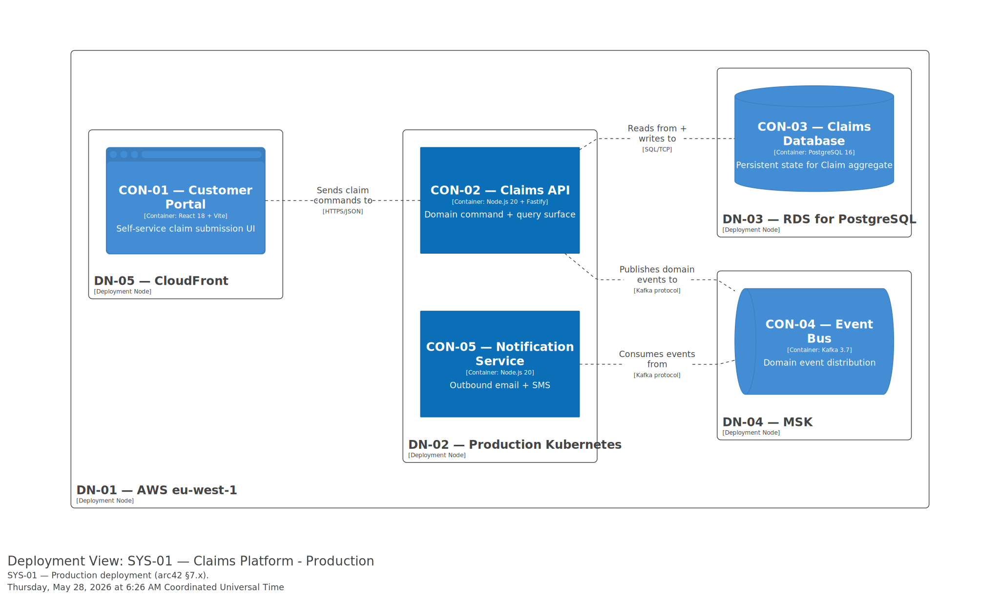

# 7. Deployment View

> "The deployment view describes the technical infrastructure used to execute your system … and the mapping of (software) building blocks to those infrastructure elements." — arc42 §7

This demo documents one environment (**Production**). Real projects would add Staging and Development as separate §7.x sub-subsections — environments differ meaningfully in instance counts, node sizes, and regions, so a combined view would obscure the differences.

## 7.1 Infrastructure overview

Single-cloud AWS in `eu-west-1`. Application containers run on EKS; data stores are AWS-managed (RDS for PostgreSQL, MSK for Kafka). The static UI is fronted by CloudFront. Multi-AZ where the cloud service supports it; single-region (multi-AZ is the SLA story, not cross-region).

### 7.1.1 Production

#### Motivation

- **EKS over Lambda:** the Claims API is stateful enough (long-lived database connections, in-process command bus) that container orchestration is a better fit than function-per-invocation.
- **RDS Multi-AZ:** the SLA target for Claim availability requires automatic failover (see future `QA-AV01`); a single-AZ instance would not meet it.
- **MSK over self-hosted Kafka:** operational simplicity; the kit doesn't run a 24/7 ops team for managing Kafka clusters.
- **CloudFront in front of CON-01:** customer-portal latency targets need geographic edge caching; the React bundle is small enough to cache aggressively.

#### Quality and/or performance features

- _Future_ `QA-AV01` — Claims API ≥ 99.9% monthly availability → addressed by 3-replica EKS deployment + RDS Multi-AZ failover.
- _Future_ `QA-PE03` — Claims API p99 latency < 200 ms → addressed by colocated RDS in the same VPC + warm connection pools.
- _Future_ `QA-SE01` — Encryption at rest → RDS Multi-AZ uses KMS-encrypted volumes; MSK has at-rest encryption enabled.

(`QA-XXNN` references will materialise once `spec-quality-attributes` has run for this demo. Currently captured as `_TODO_` cross-references.)

#### Mapping of building blocks to infrastructure

| Container | Deployment Node | Instance count | Region/AZ | Notes |
|---|---|---|---|---|
| CON-01 Customer Portal | DN-05 CloudFront | 1 distribution (global edge) | All AWS edge locations | Static React bundle; cached for 1 hour |
| CON-02 Claims API | DN-02 Production Kubernetes (EKS 1.30) | 3 pods (HPA min) | eu-west-1 multi-AZ | Tagged `primary` in DSL |
| CON-03 Claims Database | DN-03 RDS for PostgreSQL | 1 primary + 1 standby (Multi-AZ) | eu-west-1 multi-AZ | KMS-encrypted; daily backups |
| CON-04 Event Bus | DN-04 MSK | 3 brokers | eu-west-1 multi-AZ | Topic replication factor 3 |
| CON-05 Notification Service | DN-02 Production Kubernetes (EKS 1.30) | 2 pods (HPA min) | eu-west-1 multi-AZ | Co-located with CON-02 to share kube ingress + monitoring |

## Cross-references

| Linked artefact | Relationship |
|---|---|
| [`docs/architecture/decisions/`](../decisions/) | Infrastructure ADRs (hosting choice, runtime platform, database provisioning, region strategy) — referenced in Motivation paragraphs above |
| [`docs/architecture/arc42/05-building-blocks.md`](./05-building-blocks.md) | The containers (`CON-NN`) deployed below |
| [`docs/product-specs/09a-quality-attributes.md`](../../product-specs/09a-quality-attributes.md) | Quality requirements (`QA-XXNN`) — the Quality/Performance Features subsection here explains *how* the deployment achieves them |
| [`docs/ops/runbooks/`](../../ops/runbooks/) | Operational procedures that depend on this deployment structure |

## Open Items

| OI-ID | Type | Summary | Source anchor | Source heading | Resolution path | Priority | Status | Owner | Due / Review date | Tracker ref |
| :---- | :--- | :------ | :------------ | :------------- | :-------------- | :------- | :----- | :---- | :---------------- | :---------- |
| OI-003 | doc-gap | Infrastructure ADRs referenced as future work — no ADR file exists yet for hosting choice | #motivation | 7.1.1 Production — Motivation | Run `arch-adr create` for: EKS-vs-Lambda; RDS-Multi-AZ; MSK | medium | open | kit-demo | _TBD_ | _TBD_ |
| OI-004 | doc-gap | `QA-XXNN` quality attributes referenced as `_TODO_` — `spec-quality-attributes` not yet run | #qa | 7.1.1 Production — Quality features | Run `spec-quality-attributes` and back-fill the references | medium | open | kit-demo | _TBD_ | _TBD_ |
