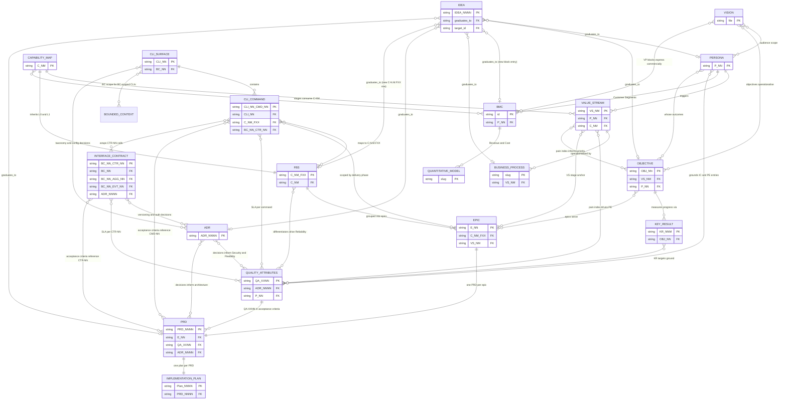

---
paths:
  - "docs/**"
  - "rules/metamodel.md"
---

# Strategic Architecture Stack — Documentation Build Order

This rule documents the **complete strategic-architecture artefact stack**
produced by the kit's `business-*` + `spec-*` skills, the **dependency graph** between
them, and the **canonical build order** Claude should follow when starting
documentation work on any new project.

When the user says *"build the documentation stack"*, *"do the strategic
docs"*, *"start the project documentation"*, or *"follow the architecture
plan"* — this rule is the authoritative reference for **what to build, in
what order, and where to put it**.

---

## The 18 artefacts and their skills

| # | Layer | Skill | Output file | Primary IDs |
|---|---|---|---|---|
| 0 | **Product Vision** (why — the north star) | `business-vision` | `docs/VISION.md` | *(singleton — no ID; referenced by path)* |
| 1 | **Personas** (who) | `business-persona` | `docs/business/01a-personas.md` | `P-NN` |
| 2 | **Business Capability Map** (what abilities) | `business-capability-map` | `docs/business/03a-capability-map.md` | `C-N.M` (e.g. `C1`, `C1.1`, `C1.1.1` at L2 rare) |
| 2b | **Bounded Context Map** (domain boundaries + context map) | `domain-bounded-context` | `docs/domain/02b-bounded-contexts.md` + `docs/domain/02b-context-map.md` | `BC-NN` |
| 2c | **Domain Glossary** (ubiquitous language per bounded context) | `domain-glossary` | `docs/domain/02c-glossary.md` | `BC-NN.GT-NN` |
| 3 | **Value Streams** (how value flows) | `business-value-stream` | `docs/business/04a-value-streams.md` + `docs/business/04a-vpc-{segment}.md` (optional VPC per VS) | `VS-N`, `VS-N.M` (stages) |
| 4.5 | **Business Objectives** (why — strategic intent) | `business-objective` | `docs/business/04b-objectives.md` | `OBJ-NN`, `KR-NN.M` |
| 4 | **Business Processes** (operational how) | `business-process` | `docs/business/05a-processes/proc-NN-{slug}.md` (one file per process) | per-process slug |
| 5 | **Business Model Canvas** (commercial wrapper) | `business-model-canvas` | `docs/business/02a-bmc.md` or `docs/business/02a-lean-canvas.md` + optional `docs/business/02a-vpc-{segment}.md` | block IDs (CS-N, VP-N, …) |
| 6 | **Quantitative models** (numbers) | `business-quantitative-model` | `docs/business/06a-models/qm-NN-{topic}.md` | per-model slug |
| 7 | **Functional Breakdown Structure** (functionality registry) | `spec-functional-breakdown-structure` | `docs/product-specs/07a-fbs.md` | `C-N.M.FXX` (capability + functionality counter) |
| 7b | **Domain Model** (entities · aggregates · value objects · domain events per BC) | `domain-model` | `docs/domain/07b-models/{bc-slug}.md` (one per BC) | `BC-NN.AGG-NN` · `BC-NN.ENT-NN` · `BC-NN.VO-NN` · `BC-NN.EVT-NN` |
| 7c | **Interface Contract** (external API surface — sync REST/gRPC/SDK + async events) | `arch-service-contract` | `docs/architecture/interfaces/{bc-slug}.md` (BC-scoped) or `docs/architecture/interfaces/{slug}.md` (product-level) | `BC-NN.CTR-NN` (BC-scoped) · `CTR-NN` (product-level) |
| 8 | **Delivery Roadmap** (Plan by Feature — delivery grouping) | `spec-delivery-roadmap` | `docs/product-specs/08a-delivery-roadmap.md` | `E-NN` |
| 8.5 | **CLI Surface Contract** (CLI command tree · flag contract · exit codes · output format — only when the product exposes a user-facing CLI) | `arch-cli-contract` | `docs/architecture/interfaces/cli-{slug}.md` (one per CLI tool) | `BC-NN.CLI-NN` / `CLI-NN` · `BC-NN.CLI-NN.CMD-NN` / `CLI-NN.CMD-NN` |
| 9 | **Quality Attributes** (how well the system performs) | `spec-quality-attributes` | `docs/product-specs/09a-quality-attributes.md` | `QA-PE01`, `QA-SE03` … (characteristic prefix + counter) |
| 10 | **PRDs** (feature specs — Build by Feature) | `spec-prd` | `docs/product-specs/prds/prd-NNNN-{feature}.md` | `PRD-NNNN` |
| 11 | **Implementation plans** (atomic increments) | `spec-implementation-plan` | `docs/exec-plans/active/{NNNN}_exec_{slug}.md` | `Plan-NNNN`, `Inc-N` |

**Supporting skills** (not in the main build order, used as needed):
- `arch-adr` — Architecture Decision Records → `docs/architecture/decisions/adr-{NNNN}-{slug}.md`. **Sequencing rule:** ADRs governing security, flexibility, or maintainability must be written before Step 9 (Quality Attributes) so the QA doc can reference them. All ADRs must precede Step 10 (PRDs) that depend on their decisions. Invoke ADRs as soon as an architectural choice must be made — they are not a post-hoc documentation exercise.
- `discovery-idea` — captures, refines, and graduates pre-formal ideas → `docs/discovery/ideation/IDEA-{NNNN}-{slug}.md` with a single `INDEX.md` at folder root; mints `IDEA-NNNN` (4-digit zero-padded); each idea carries a `graduates_to:` pointer naming the downstream skill that owns the matured artefact (`spec-prd`, `arch-adr`, `business-persona`, `business-objective`, `business-model-canvas`, `arch-research`, `business-process`, or `spec-functional-breakdown-structure`); pre-Step-0 cross-cutting node — the skill itself never writes downstream artefacts, only invokes the right one at graduation
- `spec-peer-review` — reviews PRDs / plans
- `arch-research` — Architecture Research notes that inform ADR decisions → `docs/architecture/research/{NNNN}-{slug}.md`; mints `Research-NNNN` in-doc ID (4-digit zero-padded, same convention as `ADR-NNNN`); lifecycle: Draft → Active → Frozen (once feeding ADRs land) → Superseded
- `arch-structurizr` — one-time foundation skill that scaffolds the Structurizr DSL workspace (`docs/architecture/c4/workspace.dsl`) and the Docker-based render pipeline (`render.sh` + pinned `structurizr/structurizr:<pin>-playwright` image); three modes: `init` (scaffold), `verify` (check Docker + DSL), `upgrade` (bump pinned version + re-render). Mints no IDs (infrastructure-only). Companion to `arch-c4`.
- `arch-c4` — author C4 diagrams via the Structurizr DSL; produces arc42 §3 (Context), §5 (Building Blocks), §6 (Runtime View), §7 (Deployment) markdown with embedded SVGs under `docs/architecture/arc42/`; five modes: `context` (Level 1, mints `SYS-NN`), `container` (Level 2, mints `CON-NN`), `component` (Level 3, one drill per CON-NN; mints `CMP-NN`; carries `properties.implements "BC-NN.AGG-NN"` back-reference into `domain-model` or `"none"` for tech-only components), `deployment` (per-environment, mints `DN-NN`), `runtime` (Structurizr dynamic view, mints `SCN-NN`; shows container-level runtime scenarios for key use cases). **Boundary rules:** BBV is the STATIC technical decomposition — do NOT re-state domain-model aggregate invariants. Runtime view shows HOW containers collaborate for a scenario — do NOT show intra-aggregate state machines. Requires `arch-structurizr init` to have run first.
- `arch-arc42` — four-mode skill covering the narrative arc42 sections with no C4 diagram counterpart: `constraints` (§2, mints `CST-NN`; three-category table — technical / organizational / legal-regulatory; cites source + ADR per constraint), `solution-strategy` (§4, no new IDs; navigation aid linking ADR decisions and QA-XXNN quality goals to architectural tactics; never re-states ADR rationale), `cross-cutting` (§8, mints `CC-NN`; eleven standard concept areas — authentication, authorisation, session, logging, tracing, error-handling, persistence, caching, i18n, transport security, feature flags; each entry names governing ADR + affected CON-NN containers), `risks` (§11, mints `RSK-NN`; four risk types — `architectural`, `technical-debt`, `dependency`, `security`; explicit boundary with ops runbooks; leaves hook for future `dev-tech-debt` skill). Output: `docs/architecture/arc42/{02,04,08,11}-*.md`. Reads upstream artefacts before proposing content.
- `business-competitive-landscape` — Porter Five Forces + Strategic Group Map + Value Curve + per-competitor profiles → `docs/business/01b-competitive-landscape/`; mints `CO-NN` per Tier-1 competitor profile; soft-links to personas (P-NN), BMC, capability map (C-N.M), quantitative models; run **after Step 1 (Personas)** so competitor ICPs can be mapped to persona IDs, and **before Step 2 (BMC) is filled** so competitive positioning informs the Value Propositions block rather than following it; alternatively run alongside Step 6 (quantitative models) when the primary need is competitor pricing or market-sizing data
- `discovery-research` — hypothesis-anchored interview scripts + research synthesis + research plans → `docs/discovery/interviews/`; run alongside any step where upstream artefacts carry `Assumed` claims; especially valuable after Step 1 (Personas), Step 2 (BMC), and Step 6 (Quantitative Models); synthesis feeds confidence ratings (`Assumed → Tested → Validated`) back into those artefacts; companion to `discovery-workshop` (individual reality-check vs. group reality-check) and `discovery-idea` (validates Must-be-true assumptions raised during idea refinement)
- `discovery-workshop` — workshop facilitation guides + series plans + synthesis → `docs/discovery/workshops/`; run when stakeholder alignment or group reality-checking is needed; especially valuable before Step 2 (BMC) and Step 4 (Value Streams) to build shared understanding; companion to `discovery-research` (group reality-check vs. individual reality-check); the three `discovery-*` skills share the `docs/discovery/` parent folder
- `ops-runbook`, `ops-bug-rca` — operational artefacts (post-ship)
- `util-metamodel-scaffold` — one-time initialisation: creates the canonical `docs/` folder tree (variant-aware: greenfield / brownfield / strategy-only / single-feature), generates `docs/INDEX.md` (live navigation hub with ✅/🔄/⬜ status per step), and wires a stack pointer into `CLAUDE.md`; run once per new project before any artefact-producing skill; re-run Mode 3 to refresh `docs/INDEX.md` after completing stack steps
- `util-docs-audit` — general doc staleness scan (file-level freshness, dead prose)
- `util-metamodel-audit` — deep metamodel compliance audit: 16 checks covering stack progress, folder placement, internal + external links, ID integrity + cross-references, dependency enforcement, _TODO_ density, mandatory sections, confidence distribution, expiry + staleness, orphaned files, research sync, ADR chains, FBS + epic delivery progress → report at `var/reports/metamodel-audit/`; report-only with proposed fix per finding; run monthly (active dev) or quarterly (maintenance)
- `util-metamodel-migration` — one-time migration doctor for repos built before the metamodel: scans any docs/ folder, detects misplaced files using tiered confidence scoring (filename → folder name → content signals), emits atomic fix blocks (git mv + sed link repairs) per file → report at `var/reports/metamodel-migration/`; report-only; run once before the first `util-metamodel-audit`
- `dev-stack-guide` — research a technology stack's latest official docs + MCP server, then write a developer guide covering core patterns, anti-patterns, best practices, and coding-agent integration; three modes: research (→ `docs/dev-guides/research/{tech-slug}-research.md`), draft (→ `docs/dev-guides/{tech-slug}.md`), refresh; no metamodel IDs — path-referenced only
- `dev-getting-started` — scaffold and populate a project-specific getting-started guide; reads project files (package.json, docker-compose, .env.example, Makefile, CLAUDE.md) to emit exact commands; three modes: scaffold, fill, refresh → `docs/dev-guides/getting-started.md`; singleton per project
- `dev-git-commit`, `dev-pr`, `dev-git-worktree`, `dev-ralph-loop` — developer workflow (commit, pull-request, worktree, ralph loop)
- `com-slide-deck` — HTML slide presentations → `docs/communication/slides/{slug}/` (one folder per deck, named after the presentation in kebab-case)

---

## Dependency graph (DAG)

```
   ┌──────────────────────────────────────────────────────────────┐
   │  DISCOVERY LAYER (pre-formal evidence · cross-cutting)       │
   │                                                              │
   │   discovery-idea       discovery-research    discovery-      │
   │   (capture · refine    (1:1 interviews +     workshop        │
   │    · graduate)          synthesis)           (group facil.)  │
   │   Output: IDEA-NNNN    Output: interview/    Output: workshop│
   │   graduates_to →       synthesis docs        + synthesis docs│
   │                                                              │
   │   Routing (see "Discovery routing" below the DAG):           │
   │   • discovery-idea graduates_to → any downstream node        │
   │   • discovery-research validates Assumed claims in any node  │
   │   • discovery-workshop aligns stakeholders before any node   │
   └────────────────────────────┬─────────────────────────────────┘
                                │ feeds + validates
                                ▼
   ┌──────────────────────────────────────────────────┐
   │  business-vision (Step 0)                        │
   │  (why — the north star)                          │
   │  Output: docs/VISION.md (singleton)              │
   │  Wires to: CLAUDE.md (agent context injection)   │
   └──────────────────────┬───────────────────────────┘
                          │ soft-links to all downstream artefacts
                          │
                       ┌──┴─────────────────────┐
                       │  business-persona      │
                       │  (who we serve)        │
                       │  Output: P-NN          │
                       └──────────┬─────────────┘
                                  │
              ┌───────────────────┼──────────────────────┐
              │                   │                      │
              ▼                   ▼                      ▼
   ┌──────────────────────┐ ┌────────────────────┐ ┌──────────────────────┐
   │ business-            │ │ business-          │ │ business-            │
   │   capability-map     │◄┤   value-stream     │ │   model-canvas       │
   │ (what abilities)     │ │ (how value flows)  │ │ (commercial wrapper) │
   │ Output: C-N.M        │ │ Output: VS-N.M     │ │ Soft-links P-NN,     │
   └──────────┬───────────┘ │ Stages consume     │ │   C-N.M, VS-N,       │
              │             │   C-N.M            │ │   quant models       │
              │             └──────────┬─────────┘ └──────────────────────┘
              │                        │
              │                        ▼
              │             ┌────────────────────┐
              │             │ business-process   │
              │             │ (operational how)  │
              │             │ Operationalises    │
              │             │   a VS stage       │
              │             └────────────────────┘
              │
              │             ┌────────────────────┐
              │             │ business-          │
              │             │  quantitative-model│
              │             │ (numbers / TAM)    │
              │             └────────────────────┘
              │
              │   ┌──────────────────────────────────────────┐
              │   │ business-objective (Step 4.5)            │
              │   │ (strategic intent — why)                 │
              │   │ Output: OBJ-NN, KR-NN.M                  │
              │   │ Reads: P-NN · VS-N.M pain · VP-NN (BMC)  │
              │   │ Soft-links to: E-NN · QA-XXNN · PRD-NNNN │
              │   └──────────────────────────────────────────┘
              │
              ▼
   ┌──────────────────────┐   ┌──────────────────────────────────┐
   │ arch-service-contract     │   │ spec-functional-                 │
   │ (Step 7c)            │   │   breakdown-structure            │
   │ External interface   │   │ (what product does)              │
   │   contract per BC    │   │ Output: C-N.M.FXX                │
   │ Output: BC-NN.CTR-NN │   │ Inherits L0+L1 from              │
   │ Reads: AGG/ENT/EVT   │   │   capability map                 │
   └──────────────────────┘   └──────────┬───────────────────────┘
              │
              ▼
   ┌──────────────────────┐
   │ spec-delivery-roadmap  │
   │ (Plan by Feature)    │
   │ Output: E-NN         │
   │ Groups FBS by VS     │
   │   stage + capability │
   │ Orders by pain index │
   └──────────┬───────────┘
              │  ┌──────────────────────┐  ┌─────────────────────┐
              │  │ arch-cli-contract    │  │ arch-adr            │
              │  │ (Step 8.5 — opt.)    │  │ (architecture       │
              │  │ CLI surface contract │  │  decisions)         │
              │  │ Output: CLI-NN.CMD-NN│  │ Output: ADR-NNNN    │
              │  │ Reads: FBS + E-NN    │  │ Precedes Steps 9+10 │
              │  └──────────┬───────────┘  └──────────┬──────────┘
              │             │                         │
              ▼             ▼                         ▼
   ┌──────────────────────────────────────────┐
   │ spec-quality-attributes                  │
   │ (how well the system performs — NFRs)    │
   │ Output: QA-XXNN                          │
   │ Reads: FBS ★ → Reliability targets      │
   │ Reads: ADRs → Security/Flexibility QAs  │
   │ Reads: Personas → IC/PE QAs             │
   │ Reads: VS pain index → PE priorities    │
   └──────────────────┬───────────────────────┘
                      │
                      ▼
   ┌──────────────────────────────────────────┐
   │ spec-prd (Build by Feature)              │
   │ Output: PRD-NNNN                         │
   │ One PRD per E-NN epic                    │
   │ References: E-NN · C-N.M.FXX · QA-XXNN  │
   └──────────────────┬───────────────────────┘
                      │
                      ▼
   ┌──────────────────────┐
   │ spec-implementation- │
   │   plan               │
   │ (atomic increments)  │
   │ Output: Plan-NNNN    │
   │ One plan per PRD     │
   └──────────────────────┘
```

### Discovery routing — where the discovery layer feeds the DAG

The three `discovery-*` skills are cross-cutting and not drawn as individual arrows above to keep the main DAG readable. Their routing is enumerated here.

**`discovery-idea` graduation targets** (set per idea via `graduates_to:`):

| Idea graduates to | Becomes | Pre-flight check |
|---|---|---|
| `business-persona` | `P-NN` | `01a-personas.md` exists |
| `business-objective` | `OBJ-NN` (+ `KR-NN.M`) | `04b-objectives.md` exists (scaffold if not) |
| `business-model-canvas` | new BMC block entry (`VP-NN`, `CS-NN`, …) | canvas file exists |
| `business-process` | new `proc-NN-{slug}.md` | parent `VS-N.M` stage exists |
| `arch-research` | `Research-NNNN` | no prerequisite |
| `arch-adr` | `ADR-NNNN` | architectural choice still open |
| `spec-functional-breakdown-structure` | new `C-N.M.FXX` row | parent capability `C-N.M` exists |
| `spec-prd` | `PRD-NNNN` | an `E-NN` epic exists in the delivery roadmap |

**`discovery-research` validation targets** (any artefact carrying `Assumed` confidence rows):

- `business-persona` (Tier-1 proto-personas) · `business-model-canvas` blocks · `business-value-stream` pain indices · `business-quantitative-model` inputs · `business-objective` Key Result baselines

**`discovery-workshop` alignment targets** (any artefact requiring group consensus before lock-in):

- `business-vision` (north-star alignment) · `business-model-canvas` (BMC/Lean co-creation) · `business-value-stream` (journey mapping) · `business-capability-map` (L0 axis agreement) · `business-objective` (OKR setting) · `domain-bounded-context` (Event Storming → BC boundaries)

The discovery layer never **mints** the downstream artefact itself — it produces evidence (interview synth, workshop output) or a graduation pointer (ideation), which the downstream skill consumes during its Mode 2 fill pass.

### Entity-relationship view

The ER diagram shows which ID each artefact **mints** (PK) and which upstream IDs it **consumes** (FK) as cross-references — treating the documentation system as a data model.



**Hard rules of the graph:**
- An arrow `A → B` means *B soft-links to A by ID*. B can be scaffolded without A existing (placeholder `_TODO_`), but the link is filled when A arrives.
- **No cycles.** B never feeds back into A.
- The capability map (BC Map) is the **hub** — most other artefacts soft-link to it by `C-N.M` ID.
- ADRs are **not in the linear chain** but must precede Step 9 (Quality Attributes) and Step 10 (PRDs) when their decisions affect those artefacts.
- `IDEA` is **upstream of everything** and **mints no downstream FK on the target** — the relationship is one-way: an idea graduates into a target artefact and stores the target's ID in `IDEA.target_id`. The target does **not** carry an `IDEA_NNNN` FK column; it back-references the originating idea by ID in its body text (e.g., PRD §0 traceability block), not as a structural foreign key. The cardinality is `}o--o|` (each idea graduates to 0..1 target; each target may originate from 0..1 ideas).

---

## Recommended build order — greenfield software (default)

When starting a new software product or venture from scratch, follow this
order. Each step has prerequisites + outputs Claude can verify before
moving on.

### Step 0 — Product Vision (why — the north star)

**Skill:** `business-vision`
**Prerequisites:** minimal project context (product name + target audience is enough to scaffold).
**Process:**
- Mode `scaffold` → create `docs/VISION.md` with `_TODO_` placeholders
- Mode `fill` → populate §Elevator Pitch (Moore format) · §Problem We Solve · §World We're Building Toward · §What We Are NOT · §North Star Metric
- Mode `wire` → append vision pointer to project `CLAUDE.md` so every agent session auto-loads the vision
- Mode `refresh` → update when strategy pivots; check cascading effects on personas, objectives, and BMC VPs
**Output verification:** `docs/VISION.md` exists; ≤ 400 words / ≤ 1 page; §Elevator Pitch uses Moore format; §North Star is directional (no baseline/target/deadline — those are KRs); ≥ 3 specific "NOT" guardrails; `CLAUDE.md` contains a vision pointer (Wire mode).

---

### Step 1 — Personas (who)

**Skill:** `business-persona`
**Prerequisites:** Step 0 (Product Vision — if it exists, read it; personas should reflect the vision's target audience framing)
**Process:**
- Mode `scaffold` → create `docs/business/01a-personas.md`
- Mode `backlog` → identify Tier-1 / Tier-2 / Tier-3 personas with Cooper persona types
- Mode `fill-one` → write 1–3 Tier-1 personas as proto-personas (Lean UX) or research-grounded (BABOK §10.43)
**Output verification:** `01a-personas.md` exists; ≥1 Tier-1 persona filled; `P-01` through `P-NN` assigned.

### Step 2 — Business Model Canvas / Lean Canvas (commercial wrapper)

**Skill:** `business-model-canvas`
**Prerequisites:** Step 1 (personas exist for Customer Segments soft-link).
**Process:**
- Pick variant: BMC (established) or Lean Canvas (startup) at scaffold.
- Mode `scaffold` → `docs/business/02a-bmc.md` (or `docs/business/02a-lean-canvas.md`)
- Mode `fill` → populate all 9 blocks with 3–7 terse bullets + confidence rating (Assumed/Tested/Validated)
- Mode `vpc` (optional) → one VPC companion per Tier-1 segment
**Output verification:** canvas file exists; Customer Segments link to `P-NN`; ≥1 segment populated.

### Step 3 — Business Capability Map (what abilities)

**Skill:** `business-capability-map`
**Prerequisites:** Steps 1–2 (personas for context; BMC for commercial framing).
**Process:**
- Choose L0 axis (product / value-stream / capability-domain / LOB / segment / custom). Default `capability domain` if unsure.
- Mode `scaffold` → `docs/business/03a-capability-map.md`
- Mode `structure` → enumerate L0 items (3–8) + L1 capabilities (5–12 per L0; ≤25 total)
- Mode `fill` → per-capability blocks (Definition + Business Object + Strategic Importance + Outcomes + Boundaries)
**Output verification:** capability map exists; `C1` through `C-N.M` assigned; ≥6 L1 capabilities filled; each capability passes noun test + tech-independence test + anti-overlap test.

### Step 2b — Bounded Context Map (domain boundaries)

**Skill:** `domain-bounded-context`
**Prerequisites:** Step 2 (Capability Map — capabilities are the raw material for BC identification); Step 1 (Personas — personas ground the ubiquitous language scope); Step 3 (Value Streams — stage boundaries signal context boundaries; run after value streams are catalogued).
**Process:**
- Mode `discover` → read capability map + value streams; group capabilities by domain cohesion; identify boundary signals (where same word means different things; where data ownership changes; where team handoff happens); name bounded contexts
- Classify each BC: Core (competitive differentiator) / Supporting (enables Core) / Generic (commodity — buy or outsource)
- Mode `fill` → per-BC definition sections + context map with integration patterns (ACL, Shared Kernel, Customer-Supplier, Open Host Service, Published Language, Conformist)
**Output verification:** `02b-bounded-contexts.md` + `02b-context-map.md` exist; every capability `C-N.M` assigned to exactly one `BC-NN`; each BC has subdomain type + rationale; context map names integration patterns (not just "they communicate"); 1–3 Core subdomains.

### Step 2c — Domain Glossary (ubiquitous language)

**Skill:** `domain-glossary`
**Prerequisites:** Step 2b (Bounded contexts provide the namespace — one glossary section per BC).
**Process:**
- Mode `seed` → extract nouns from capability names + value stream stage names + process actor names; assign `GT-NN` IDs per BC; write one-line definitions
- Mode `enrich` → full definitions in business language + example sentences + deprecated aliases + cross-context translations + code convention notes
**Output verification:** `glossary.md` exists; every BC-NN has a glossary section; capability names have corresponding GT-NN entries; no living synonyms within a BC; definitions in business language only.
**Living document:** the glossary is never "done" — run Mode `maintain` (Step 0: trigger type + scope) every sprint for Core BC; add changelog entry for every term added, deprecated, or retired; bump `glossary-version` on structural changes.

### Step 4 — Value Streams (how value flows)

**Skill:** `business-value-stream`
**Prerequisites:** Step 1 (triggering stakeholders link to personas); Step 3 (stages consume capabilities by C-N.M ID).
**Process:**
- Mode `scaffold` → `docs/business/04a-value-streams.md`
- Mode `catalogue` → enumerate 3–10 streams per product scope, one per Tier-1 persona × value-proposition pair
- Mode `fill-one` → full stream body with 4–10 stages, each consuming 1–4 capabilities + pain index
**Output verification:** value-streams file exists; ≥1 stream fully filled; each stage links to ≥1 capability by `C-N.M` ID.

### Step 4.5 — Business Objectives (why — strategic intent)

**Skill:** `business-objective`
**Prerequisites:** Step 1 (Personas — whose outcomes the objectives serve); Step 2 (BMC — `VP-NN` Value Propositions are the commercial intent that objectives operationalise); Step 4 (Value Streams — pain index per `VS-N.M` prioritises which objectives matter most).
**Process:**
- Mode `scaffold` → create `docs/business/04b-objectives.md` with OBJ-NN placeholder blocks
- Mode `fill` → populate each OBJ-NN: qualitative title, BSC perspective tag, timeframe, owner, "why it matters" sentence linked to `VP-NN` or `VS-N.M` pain index; 3–5 Key Results per objective (outcome statements with baseline, target, measurement method)
- Mode `align` → after the delivery roadmap exists, build the §Objective × Epic traceability matrix; flag orphaned epics (no OBJ-NN) and undelivered objectives (no E-NN)
- Mode `refresh` → update KR baselines/targets when evidence arrives; add changelog entry
**Output verification:** `objectives.md` exists; ≥1 OBJ-NN filled with qualitative title + BSC perspective + timeframe + owner; every KR is an outcome (metric change), not an output (feature delivery); every OBJ-NN traces to ≥1 `VP-NN` or `VS-N.M`; 2–5 objectives total; ≥1 Customer-perspective objective.

---

### Step 5 — Business Processes (operational how)

**Skill:** `business-process`
**Prerequisites:** Step 4 (processes operationalise value-stream stages — but processes can also exist independently for non-customer-facing operations).
**Process:**
- One process doc per major operational workflow.
- Mode `scaffold` per process → `docs/business/05a-processes/proc-NN-{slug}.md`
- Fill BPMN-ready template (actors, activities, data, KPIs, decisions).
**Output verification:** each Tier-1 value-stream stage has ≥1 process doc operationalising it.

### Step 6 — Quantitative Models (numbers)

**Skill:** `business-quantitative-model`
**Prerequisites:** Step 2 (BMC's Revenue Streams + Cost Structure provide qualitative anchors); Step 1 (personas drive segmentation).
**Process:**
- One model per quantification need: TAM/SAM/SOM, savings, ROI, restitution, unit economics.
- Each model file in `docs/business/06a-models/qm-NN-{topic}.md`.
**Output verification:** ≥1 model exists; BMC's Revenue Streams + Cost Structure link to relevant models.

### Step 7 — Functional Breakdown Structure (what product does, status-tracked)

**Skill:** `spec-functional-breakdown-structure`
**Prerequisites:** Step 3 (BC Map — FBS inherits L0+L1).
**Process:**
- Mode `scaffold` → `docs/product-specs/07a-fbs.md`
- Mode `structure` → auto-import L0+L1 from BC Map; pre-fill per-capability sections
- Mode `fill` → enumerate functionalities per capability with `C-N.M.FXX` IDs + status (✅/🔄/⬜) + optional VS-stage links + code paths
**Output verification:** FBS exists; ≥1 capability has ≥1 functionality; status distribution shows initial state.

### Step 7b — Domain Model (entities · aggregates · value objects · domain events)

**Skill:** `domain-model`
**Prerequisites:** Step 2b (Bounded contexts provide BC-NN namespace); Step 2c (Glossary terms — entity names MUST match GT-NN); Step 7 (FBS — functionalities reveal candidate entities and aggregates); Step 3 (Value Stream stages — stage transitions reveal domain events).
**Process:**
- One file per bounded context: `docs/domain/07b-models/{bc-slug}.md`
- Mode `fill` → per aggregate: root, invariants, lifecycle states, command→event pairs; per entity: identity, attributes, behaviour methods; per value object: attributes, equality rule, validation invariants; per domain event: trigger, payload, consumers, business significance
- Mode `verify` → check for anemic model (entities must have behaviour); check aggregate sizing (≤5 members); check event naming (past tense + business-meaningful)
**Output verification:** one `{bc-slug}.md` per BC-NN in `docs/domain/07b-models/`; every aggregate has a named root + ≥2 documented invariants; all entity names match GT-NN glossary terms; all domain events are past tense + carry business significance; Mermaid class diagram present.

### Step 7c — Interface Contract (external API + async surface per BC)

**Skill:** `arch-service-contract`
**Prerequisites:** Step 7b (Domain Model — aggregates, entities, value objects, domain events are the raw material for the contract); Step 2c (Glossary — resource and event names must match GT-NN terms); relevant ADRs for versioning strategy, auth mechanism, and event-bus choice.
**Process:**
- Mode `scaffold` → create `docs/architecture/interfaces/{bc-slug}.md` with `_TODO_` placeholders; one file per BC
- Mode `contract-first` → read domain model (AGG-NN, ENT-NN, EVT-NN); map aggregates to REST resources; map domain events to async events; define error contract (RFC 7807), versioning policy, and security surface; assign `BC-NN.CTR-NN` IDs
- Mode `document-existing` → reverse-engineer from route files or OpenAPI specs; emit drift report (surface elements with no domain model backing)
- Mode `refresh` → detect additions, removals, renames vs. current domain model; classify breaking vs non-breaking changes; append changelog
**Output verification:** `docs/architecture/interfaces/{bc-slug}.md` exists; every CTR-NN entry maps to a `BC-NN.AGG-NN`, `BC-NN.ENT-NN`, or `BC-NN.EVT-NN`; no verb in REST paths (exception: `/actions/{verb}`); pagination envelope on all collection endpoints; RFC 7807 error contract present; versioning and security surfaces present; CTR-NN IDs monotonically assigned.

---

### Step 8 — Delivery Roadmap (Plan by Feature + Walking Skeleton + Phase Goals)

**Skill:** `spec-delivery-roadmap`
**Prerequisites:** Step 7 (FBS — VS stage links + phase tags + ★ markers); Steps 3–4 (Value Streams — pain index + value propositions); Step 1 (Personas — for walking skeleton narrative).
**Process:**
- Read FBS + value streams + personas
- Group FBS functionalities by VS stage affinity + capability cluster → E-NN epics
- Order by pain index; assign E-NN IDs in priority order
- Define Walking Skeleton: identify the primary VS to validate; select minimum functionalities per epic covering every VS stage end-to-end; write "can / cannot yet" statement
- Define Phase Plan: declare which VS streams become fully operational per phase; write one-sentence goal per phase
- Produce `docs/product-specs/08a-delivery-roadmap.md`
- Coverage check: every Phase 1 FBS functionality in exactly one epic
**Output verification:** `docs/product-specs/08a-delivery-roadmap.md` exists; §Walking Skeleton covers every stage of primary VS; §Phase Plan has one goal per phase expressed as VS streams operational; every epic has a value statement; ★ functionalities each anchor their own epic; sizing within 5–25 FBS rows per epic; E-NN IDs in pain-index order.

### Step 8.5 — CLI Surface Contract (only when the product exposes a CLI)

**Skill:** `arch-cli-contract`
**Prerequisites:** Step 7 (FBS — `C-N.M.FXX` functionalities map to CLI commands); Step 8 (Delivery Roadmap — `E-NN` phase tags drive `status: planned` vs `status: active` per command). ADRs for command taxonomy, config format, and output format should be written before or alongside this step.
**Process:**
- Mode `scaffold` → create `docs/architecture/interfaces/cli-{slug}.md` with `_TODO_` skeleton
- Mode `design` → read FBS + delivery roadmap; derive command tree by capability cluster; assign `CLI-NN.CMD-NN` IDs; define global flags, exit code catalogue, stdout/stderr contract, configuration precedence
- Mode `document-existing` → parse `--help` output or source; emit drift report (commands with no FBS backing; FBS functionalities not yet surfaced)
- Mode `refresh` → detect added/removed commands vs current FBS; classify breaking vs non-breaking; append changelog
**Output verification:** `docs/architecture/interfaces/cli-{slug}.md` exists; every `CLI-NN.CMD-NN` maps to a `C-N.M.FXX` or `E-NN`; `--help` and `--version` documented; stdout/stderr separation explicit; exit code catalogue present; `--dry-run` on all mutating commands; `--output json` documented; colour policy present.

---

### Step 9 — Quality Attributes (how well the system performs)

**Skill:** `spec-quality-attributes`
**Prerequisites:** Step 7 (FBS differentiators ★ drive Reliability targets); Step 8 (epic scope clarifies which QA entries apply to which delivery cluster); relevant ADRs (Security, Flexibility, Maintainability QAs reference ADR decisions); Step 1 (Personas ground IC and PE entries); Steps 3–4 (VS pain index prioritises PE entries).
**Process:**
- Mode `scaffold` → create `docs/product-specs/09a-quality-attributes.md` with ISO/IEC 25010:2023 characteristic sections
- Mode `fill` → one entry per sub-characteristic × product scope; measurable acceptance criterion + verification method; persona-grounded for IC and PE; reference ADR IDs for Security/Flexibility/Maintainability decisions
**Output verification:** file exists; ≥1 entry per relevant ISO characteristic; all entries have measurable acceptance criteria; IC/PE entries reference P-NN personas; differentiator FBS features (★) have Reliability entries.

### Step 10 — PRDs (Build by Feature)

**Skill:** `spec-prd`
**Prerequisites:** Step 8 (one PRD per E-NN epic — scope pre-defined); Step 9 (PRDs reference `QA-XXNN` in acceptance criteria); relevant ADRs (PRDs do not re-open decided architectural choices).
**Process:**
- One PRD per epic: `docs/product-specs/prds/prd-NNNN-{feature}.md`
- Each PRD: §0 Architecture Traceability (E-NN, P-NN, C-N.M, QA-XXNN, FBS scope) · problem · goals · non-goals · user stories (persona-grounded, P-NN) · acceptance criteria · success metrics
**Output verification:** ≥1 PRD per active epic (E-NN); each PRD references its E-NN, FBS IDs, and QA IDs; FBS functionality status promoted ⬜ → 🔄; Delivery Roadmap PRD link filled.

### Step 11 — Implementation Plans (atomic increments)

**Skill:** `spec-implementation-plan`
**Prerequisites:** Step 10 (PRDs).
**Process:**
- One plan per PRD: `docs/exec-plans/active/{NNNN}_exec_{slug}.md`
- Each plan: numbered increments (Inc-1, Inc-2, …), each small + testable + reversible.
**Output verification:** each in-flight PRD has a corresponding plan; plan increments are atomic + testable.

### Ongoing — ADRs, runbooks, ideas, audit

Not numbered in the linear build order but sequencing matters:
- `arch-adr` → invoke as soon as an architectural choice must be made; ADRs governing security, flexibility, or maintainability must precede Step 9 (Quality Attributes); all ADRs must precede Step 10 (PRDs) that depend on their decisions
- `ops-runbook` → operational procedures captured post-ship
- `ops-bug-rca` → root cause analyses post-incident
- `discovery-idea` → pre-formal idea capture, refinement, and graduation (an idea graduates to whichever downstream skill matches its matured form — `spec-prd`, `arch-adr`, `business-persona`, `business-objective`, etc.)
- `spec-peer-review` → PRD / plan review before implementation
- `util-docs-audit` → periodic health check (quarterly)

---

## Variants for non-greenfield projects

### Brownfield IT project (existing system, adding capability)

Start at **Step 3** (Business Capability Map), skip Steps 1–2 unless:
- The capability touches a stakeholder group not yet documented (then do Step 1 lightweight for that persona).
- The capability changes the commercial model (then do Step 2 — usually skipped).

**Sequence:** Step 3 (BC Map) → Step 4 (value stream for the affected flow) → Step 5 (process docs for the as-is operational state) → Step 2b (Bounded Context Map) → Step 2c (Glossary) → Step 7 (FBS) → Step 7b (Domain Model) → Step 8 (Delivery Roadmap) → Step 9 (Quality Attributes — at minimum Reliability entries for new differentiator features) → Step 10 (PRDs) → Step 11 (plans).

### Single feature (no full architecture work)

Skip Steps 1–8 entirely. Go straight to:
- Step 10 (`spec-prd`) for the feature — manually define the E-NN scope inline in §0.
- Step 11 (`spec-implementation-plan`) for the plan.

Optionally: `discovery-idea` first if the feature is still hypothetical — refine it through the divergent/convergent loop, then graduate to `spec-prd`. Write relevant ADRs before the PRD if architecture decisions are open. Write domain model for the feature's aggregate (Step 7b) if the aggregate isn't already modelled.

### Strategy / investor / executive engagement only

Start at **Step 2** (BMC) for the strategic one-pager. Skip Steps 7–11 entirely. Optionally add:
- Step 1 (personas) — investors love seeing customer specificity.
- Step 6 (quantitative model) — TAM/SAM/SOM for the deck.
- Step 3 (BC Map) — only if the strategic conversation needs the capability lens.

---

## Cross-doc ID conventions

| ID format | Meaning | Owned by |
|---|---|---|
| `P-NN` | Persona | `business-persona` |
| `C-N.M` (e.g. `C1`, `C1.1`, `C1.1.1`) | Capability (L0 / L1 / L2) | `business-capability-map` |
| `VS-N` | Value stream | `business-value-stream` |
| `VS-N.M` | Value-stream stage | `business-value-stream` |
| `OBJ-NN` | Business Objective | `business-objective` |
| `KR-NN.M` | Key Result (M under Objective N) | `business-objective` |
| `C-N.M.FXX` | Functionality (capability + counter) | `spec-functional-breakdown-structure` |
| `BC-NN` | Bounded Context | `domain-bounded-context` |
| `BC-NN.GT-NN` | Glossary Term (scoped to bounded context) | `domain-glossary` |
| `BC-NN.AGG-NN` | Aggregate root (scoped to bounded context) | `domain-model` |
| `BC-NN.ENT-NN` | Entity (scoped to bounded context) | `domain-model` |
| `BC-NN.VO-NN` | Value Object (scoped to bounded context) | `domain-model` |
| `BC-NN.EVT-NN` | Domain Event (scoped to bounded context) | `domain-model` |
| `BC-NN.CTR-NN` | Interface Contract element, **BC-scoped** — API is the direct surface of one BC (microservices, per-service APIs) | `arch-service-contract` |
| `CTR-NN` | Interface Contract element, **product-level** — API spans multiple BCs (BFF, gateway, GraphQL schema); `Delegates to` field records the BC-NN per resource | `arch-service-contract` |
| `BC-NN.CLI-NN` | CLI tool surface, **BC-scoped** — one CLI per BC/service | `arch-cli-contract` |
| `CLI-NN` | CLI tool surface, **product-level** — one CLI spanning multiple BCs; BC-NN column per command records the BC it delegates to | `arch-cli-contract` |
| `BC-NN.CLI-NN.CMD-NN` or `CLI-NN.CMD-NN` | CLI command — scoped to match the parent CLI tool's ID format | `arch-cli-contract` |
| `SYS-NN` | Software System in the C4 model (DSL identifier `SYS_NN`) — system being documented + external systems | `arch-c4` (context mode) |
| `CON-NN` | Container in the C4 model (DSL identifier `CON_NN`) — deployable runtime unit (app, service, database, message broker) | `arch-c4` (container mode) |
| `CMP-NN` | Component in the C4 model (DSL identifier `CMP_NN`) — code module inside a container; carries `properties.implements "BC-NN.AGG-NN"` back-reference into `domain-model` (or `"none"` for tech-only) | `arch-c4` (component mode) |
| `DN-NN` | Deployment Node in the C4 model (DSL identifier `DN_NN`) — infrastructure element (region, cluster, VM, managed service) | `arch-c4` (deployment mode) |
| `SCN-NN` | Runtime scenario in the C4 dynamic view — one per key use case or error path documented in arc42 §6 | `arch-c4` (runtime mode) |
| `CST-NN` | Architecture constraint — technical, organizational, or legal-regulatory constraint limiting the solution space | `arch-arc42` (constraints mode) |
| `CC-NN` | Cross-cutting concept — horizontal concern applying to multiple containers (auth, logging, error-handling, persistence, caching, etc.) | `arch-arc42` (cross-cutting mode) |
| `RSK-NN` | Architectural risk or technical debt item — four types: `architectural`, `technical-debt`, `dependency`, `security` | `arch-arc42` (risks mode) |
| `E-NN` | Epic + walking skeleton + phase plan (delivery roadmap) | `spec-delivery-roadmap` |
| `QA-XXNN` | Quality attribute (characteristic prefix + counter, e.g. `QA-PE01`, `QA-SE03`) | `spec-quality-attributes` |
| `PRD-NNNN` | PRD ID | `spec-prd` |
| `Plan-NNNN` | Implementation plan | `spec-implementation-plan` |
| `Inc-N` (within a plan) | Plan increment | `spec-implementation-plan` |
| `ADR-NNNN` | Architecture decision | `arch-adr` |
| `Research-NNNN` | Architecture research note | `arch-research` |
| `IDEA-NNNN` | Pre-formal idea (capture · refine · graduate) | `discovery-idea` |
| `CO-NN` | Competitor profile (Tier-1) | `business-competitive-landscape` |
| Block ID in BMC (e.g., `CS-1`, `VP-1`) | Canvas block | `business-model-canvas` |

**BC-NN namespace rule:** All tactical DDD IDs are scoped to their bounded context. `BC-01.AGG-03` and `BC-02.AGG-03` are different aggregates. Cross-references must always include the BC prefix — bare `AGG-03` is ambiguous and invalid.

**Cross-doc linking rule:** any artefact that references another should use the ID + name + relative path:

> `[C3.2 KOGU prior-authorisation classification](../03a-capability-map.md#c32)` 

so that future renames (description text) don't break the link as long as the ID is stable.

---

## Canonical output paths

```
docs/
├── VISION.md                                            ← business-vision (Step 0 — singleton, agent north star)
├── business/                                            ← Business Architecture artefacts (numbered = build order)
│   ├── 01a-personas.md                                   ← business-persona (P-NN)
│   ├── 02a-bmc.md  (or 02a-lean-canvas.md)               ← business-model-canvas (Step 2)
│   ├── 02a-vpc-{segment}.md  (optional per CS)          ← BMC VPC companions
│   ├── 03a-capability-map.md                             ← business-capability-map (C-N.M)
│   ├── 04a-value-streams.md                              ← business-value-stream (VS-N.M)
│   ├── 04a-vpc-{segment}.md  (optional per VS)           ← VS VPC companions
│   ├── 04b-objectives.md                                ← business-objective (OBJ-NN, KR-NN.M)
│   ├── 05a-processes/                                   ← multi-file; keep subfolder
│   │   └── proc-NN-{slug}.md (one per process)
│   └── 06a-models/                                      ← multi-file; keep subfolder
│       └── qm-NN-{topic}.md (TAM/SAM/SOM, savings, ROI per model)
├── product-specs/                                       ← `spec-` skills (product delivery)
│   ├── 07a-fbs.md                                        ← spec-functional-breakdown-structure (C-N.M.FXX)
│   ├── 08a-delivery-roadmap.md                           ← spec-delivery-roadmap (E-NN)
│   ├── 09a-quality-attributes.md                         ← spec-quality-attributes (QA-XXNN)
│   └── prds/                                            ← all PRDs in dedicated subfolder
│       └── prd-NNNN-{feature}.md (one per PRD)          ← spec-prd (PRD-NNNN)
├── exec-plans/                                          ← `spec-` skills (implementation)
│   └── active/
│       └── {NNNN}_exec_{slug}.md  (one file per plan)
├── architecture/                                        ← `arch-` skills
│   ├── decisions/                                       ← arch-adr writes here
│   │   └── adr-{NNNN}-{slug}.md
│   ├── interfaces/                                      ← arch-service-contract + arch-cli-contract
│   │   ├── {bc-slug}.md  (BC-scoped API, one per BC)    ← arch-service-contract (BC-NN.CTR-NN)
│   │   ├── {slug}.md  (product-level API, spans BCs)    ← arch-service-contract (CTR-NN)
│   │   └── cli-{slug}.md  (one per CLI tool)            ← arch-cli-contract (BC-NN.CLI-NN or CLI-NN)
│   ├── c4/                                              ← arch-structurizr foundation
│   │   ├── workspace.dsl                                ← Structurizr DSL (single source of truth for C4 model)
│   │   ├── render.sh                                    ← Docker render pipeline (pinned structurizr/structurizr:<pin>-playwright)
│   │   ├── README.md                                    ← per-project render + pinning conventions
│   │   └── views/                                       ← rendered SVGs (committed)
│   │       ├── systemContext.svg                        ← arc42 §3 visual
│   │       ├── containers.svg                           ← arc42 §5.1 visual
│   │       ├── components-CON-NN.svg                    ← arc42 §5.2 visuals (one per drilled container)
│   │       └── deployment-{env}.svg                     ← arc42 §7 visuals (one per environment)
│   └── arc42/                                           ← arch-c4 (diagram sections) + arch-arc42 (narrative sections)
│       ├── 02-constraints.md                            ← arc42 §2 (CST-NN; technical/org/legal constraints)
│       ├── 03-context.md                                ← arc42 §3 (SYS-NN context + actors + external systems)
│       ├── 04-solution-strategy.md                      ← arc42 §4 (ADR links + quality goal → tactic mapping; no new IDs)
│       ├── 05-building-blocks.md                        ← arc42 §5 (containers + components; CON-NN, CMP-NN)
│       ├── 06-runtime-view.md                           ← arc42 §6 (SCN-NN runtime scenarios via Structurizr dynamic views)
│       ├── 07-deployment.md                             ← arc42 §7 (per-environment deployment; DN-NN)
│       ├── 08-cross-cutting-concepts.md                 ← arc42 §8 (CC-NN cross-cutting concept catalogue)
│       └── 11-risks.md                                  ← arc42 §11 (RSK-NN architectural risks + tech debt register)
├── domain/                                              ← `domain-` skills (DDD artefacts — numbered by step)
│   ├── 02b-bounded-contexts.md                          ← domain-bounded-context (BC-NN)
│   ├── 02b-context-map.md                               ← domain-bounded-context (context map)
│   ├── 02c-glossary.md                                  ← domain-glossary (BC-NN.GT-NN)
│   └── 07b-models/                                      ← domain model files per BC
│       └── {bc-slug}.md                                 ← domain-model (one per BC)
├── ops/                                                 ← `ops-` skills
│   ├── runbooks/
│   │   └── {slug}.md
│   └── rcas/
│       └── {YYYY-MM-DD}-{slug}.md
├── communication/                                       ← `com-` skills
│   └── slides/
│       └── {slug}/                                      ← com-slide-deck (one folder per deck)
│           ├── context/
│           ├── design/
│           ├── src/                                     ← slide partials (source of truth)
│           ├── dist/                                    ← built HTML + prototypes/
│           └── config.yaml
├── discovery/                                           ← `discovery-` skills (pre-formal evidence layer; cross-cutting; feeds every downstream artefact)
│   ├── ideation/                                       ← discovery-idea (IDEA-NNNN)
│   │   ├── INDEX.md
│   │   └── IDEA-NNNN-{slug}.md (one per idea)
│   ├── interviews/                                     ← discovery-research
│   │   └── interview-{persona-id-or-slug}-{topic}.md · research-synthesis-{date}-{topic}.md · research-plan-{topic}.md
│   └── workshops/                                      ← discovery-workshop
│       └── workshop-{slug}-{date}.md · workshop-synthesis-{slug}-{date}.md
└── dev-guides/                                         ← `dev-stack-guide` + `dev-getting-started` (developer reference; not a metamodel step)
    ├── getting-started.md                              ← dev-getting-started (singleton — project onboarding guide)
    ├── {tech-slug}.md (one per technology)             ← dev-stack-guide (stack guide: patterns, anti-patterns, MCP)
    └── research/                                       ← dev-stack-guide research scratch (internal; committed for traceability)
        └── {tech-slug}-research.md
```

**Prefix → folder mapping (memorise this):**

| Prefix | Folder | Note |
|---|---|---|
| `business-` | `docs/business/` | All BIZBOK Business Architecture artefacts. **Exception:** `business-vision` outputs to `docs/VISION.md` (project root level) for agent-context visibility — the only `business-` skill whose output is not under `docs/business/`. |
| `discovery-` | `docs/discovery/` | Pre-formal evidence layer — ideation, 1:1 research, group workshops. Cross-cutting; feeds every downstream artefact. Subfolders per artefact (`ideation/`, `interviews/`, `workshops/`). |
| `spec-` | `docs/product-specs/`, `docs/exec-plans/` | Product specs and execution plans |
| `arch-` | `docs/architecture/` | Subfolders per artefact (e.g., `decisions/` for ADRs) |
| `domain-` | `docs/domain/` | DDD artefacts — the shared language between business and tech (bounded contexts, glossary, domain model) |
| `ops-` | `docs/ops/` | Subfolders per artefact (`runbooks/`, `rcas/`) |
| `com-` | `docs/communication/` | Communication artefacts (slide decks, presentations). Subfolders per artefact type (e.g. `slides/`). |
| `dev-` | *(no doc folder)* for workflow utilities · **exception:** `dev-stack-guide` → `docs/dev-guides/{tech-slug}.md` + `docs/dev-guides/research/`; `dev-getting-started` → `docs/dev-guides/getting-started.md` | Developer-workflow utilities; `dev-stack-guide` and `dev-getting-started` are the only `dev-` skills that write to `docs/` |
| `util-` | *(no doc folder)* | Housekeeping |

---

## Open Items governance (cross-cutting)

Every artefact in the stack can carry unresolved work — research questions, missing
decisions, follow-up items, deferred refactors. The canonical contract for capturing,
classifying, syncing, and auditing that work lives in
[`rules/open-items-governance.md`](./open-items-governance.md). It is mandatory for any
skill whose output may emit unresolved work.

Summary of the contract (full details in the dedicated rule):

- **Single section:** each artefact exposes one **document-level** `## Open Items` section.
  No nested `### Open Items` subsections, no legacy variants (`Open / TODO`, `Open
  questions remaining`, `§Open Issues`).
- **Item taxonomy:** every row is one of `doc-gap`, `decision-gap`, `execution-item`,
  `tech-debt`. Inline `_TODO_` scaffold placeholders are explicitly **not** open items.
- **Provenance:** rows that originate in a sub-section of the artefact carry both a
  `Source anchor` (short fragment identifier like `#q3`) and a `Source heading` (the full
  human-readable heading text). The pair survives anchor renames and heading edits.
- **Central control plane:** the consolidated living ledger is
  `docs/project-control/open-items/` — under `docs/` for unified navigation but in a
  dedicated `project-control/` folder because it is an operational system of record, not
  a product artefact (so product-spec audits don't sweep it). Product backlog (PRDs, FBS,
  epics) remains separate.
- **Tooling boundaries:** `util-docs-audit` stays generic. `util-open-items` performs
  ledger CRUD. `util-metamodel-audit` is report-only and verifies governance drift.

When a new skill produces or governs unresolved work, conform to §8 of
`rules/open-items-governance.md` (Skill conformance checklist) — canonical heading, schema,
provenance, sync chaining.

---

## How Claude should use this rule

When the user invokes documentation work on a project:

1. **Detect what already exists** — `find docs -type d` to map the current state.
2. **Identify which steps are done vs missing** by checking output paths above.
3. **Pick the variant** (greenfield / brownfield / single-feature / strategy-only) based on user intent.
4. **Execute the next step** using the corresponding skill in its appropriate mode.
5. **Verify the output** before moving on — each step's "Output verification" criteria.
6. **Maintain cross-doc IDs** — every soft-link should use the ID + path format above.

When asked *"build the documentation plan"* without further context, default to:
- Confirm the variant with the user (greenfield is the default).
- Start at Step 1; ask for personas input.
- Proceed sequentially through verification checks.
- One step per session unless the user wants batch execution.

This rule is the single source of truth for the strategic-architecture
build order. When new skills join the kit, update the layer table and
DAG here.

**Maintenance coupling — update these files whenever this rule changes:**

Every change to canonical paths, artefact steps, or ID formats in this file has downstream copies that must be kept in sync:

| What changed | Also update |
|---|---|
| New artefact step, new canonical path | `util-metamodel-audit/references/check-catalogue.md` → Check 1 (stack progress paths) |
| New ID format (e.g. new `XX-NN` pattern) | `util-metamodel-audit/references/check-catalogue.md` → Check 5 (ID cross-reference regex patterns) |
| New prerequisite dependency in the DAG | `util-metamodel-audit/references/check-catalogue.md` → Check 7 (dependency enforcement rules) |
| New artefact step, new canonical path | `util-metamodel-migration/references/detection-signals.md` → §Filename patterns + §Folder name patterns + §Content signals |
| New mandatory section in a skill's template | `util-metamodel-audit/references/check-catalogue.md` → Check 9 (mandatory sections table) |
| New artefact step, new canonical path | `util-metamodel-scaffold/references/folder-catalogue.md` → all four variant folder lists (add to Greenfield; add to Brownfield/Strategy/Single-feature if relevant) |
| New artefact step, new canonical path | `util-metamodel-scaffold/references/index-template.md` → §Detection bash block + §Template stack-progress table (add detection command + row) |

Failing to update these files after a metamodel change will cause the audit and migration skills to silently miss the new artefact — the most dangerous kind of drift.

**Already-updated coupling (arch-c4 runtime mode + arch-arc42, 2026-05-28):**
`rules/metamodel.md` supporting-skills list (`arch-c4` bullet updated to 5 modes + SCN-NN; `arch-arc42` bullet added) + ID conventions table (`SCN-NN`, `CST-NN`, `CC-NN`, `RSK-NN`) + canonical paths tree (`arc42/` subtree expanded to all 8 sections: §2/§3/§4/§5/§6/§7/§8/§11) + this table · `README.md` skill index (`arch-arc42` row added) · `util-metamodel-audit/references/check-catalogue.md` Check 1 (arc42 §2/§4/§6/§8/§11 file detection added) + Check 5 (`SCN-\d{2}`, `CST-\d{2}`, `CC-\d{2}`, `RSK-\d{2}` ID patterns added) + Check 9 (mandatory section rules for §2, §4, §6, §8, §11 added) · `util-metamodel-migration/references/detection-signals.md` §Filename patterns (02-constraints.md, 04-solution-strategy.md, 06-runtime-view.md, 08-cross-cutting-concepts.md, 11-risks.md) + §Content signals (CST-NN, SCN-NN, CC-NN, RSK-NN ID patterns) · `BACKLOG.md` (Milestone 2 shipped block added)

**Already-updated coupling (arch-structurizr + arch-c4, 2026-05-28):**
`rules/metamodel.md` supporting-skills list (2 new bullets after `arch-research`) + ID conventions table (SYS-NN, CON-NN, CMP-NN, DN-NN — all owned by `arch-c4`) + canonical paths tree (`docs/architecture/c4/` foundation + `docs/architecture/arc42/` markdown sections under the existing `architecture/` subtree) + this table · `README.md` skill index (2 new rows) · `util-metamodel-audit/references/check-catalogue.md` Check 1 (arc42 markdown detection at `docs/architecture/arc42/{03,05,07}*.md`) + Check 2 (`docs/architecture/c4/` + `docs/architecture/arc42/` canonical paths) + Check 5 (regex patterns `SYS-\d{2}`, `CON-\d{2}`, `CMP-\d{2}`, `DN-\d{2}`) + Check 9 (mandatory `Domain aggregates implemented` column in §5 component tables) · `util-metamodel-migration/references/detection-signals.md` §Filename patterns (`workspace.dsl`, `03-context.md`, `05-building-blocks.md`, `07-deployment.md`) + §Folder patterns (`architecture/c4/`, `architecture/arc42/`) + §Content signals (Structurizr DSL `workspace "..."`, arc42 section headings) · `BACKLOG.md` (Shipped 2026-05-28 section: `arch-c4` Tier 1 entry retired, new pair logged) · `domain-model/SKILL.md` (minor additive: optional `Realised by: CMP-NN (in CON-NN)` field per aggregate, filled by `arch-c4 component`; empty before then) · `examples/c4-demo/` (kit-internal validation snapshot exercising all 4 modes end-to-end)

**Already-updated coupling (dev-stack-guide + dev-getting-started, 2026-05-28):**
`rules/metamodel.md` supporting-skills list (dev-* bullet expanded to 4 bullets: dev-stack-guide, dev-getting-started, workflow utilities, com-slide-deck) + canonical paths tree (`docs/dev-guides/` subtree added after `discovery/`) + prefix→folder mapping (`dev-` row updated with exception note) + this table · `util-metamodel-audit/references/check-catalogue.md` Check 2 (docs/dev-guides/ added as canonical path; getting-started.md + {tech-slug}.md + research/ exempt from misplacement) · `util-metamodel-migration/references/detection-signals.md` §Filename patterns (getting-started.md under docs/dev-guides/ → dev-getting-started; {tech-slug}-research.md under docs/dev-guides/research/ → dev-stack-guide) + §Folder patterns (dev-guides/ folder) + §Content signals (## Stack identity → dev-stack-guide) · `BACKLOG.md` (Shipped 2026-05-28 section added)

**Already-updated coupling (arch-cli-contract promoted to Step 8.5 + ER symmetry fix, 2026-05-26):**
`rules/metamodel.md` artefact count (16→18) + artefact table (row 8.5 added) + supporting-skills list (arch-cli-contract bullet removed — promoted to step) + DAG (Step 8.5 node alongside arch-adr) + ER diagram (merge conflict resolved: IDEA entity from branch merged; CLI_SURFACE.BC_NN FK added; CLI_COMMAND.BC_NN_CTR_NN FK added; CLI_SURFACE→BOUNDED_CONTEXT, CLI_SURFACE→ADR, CLI_COMMAND→QUALITY_ATTRIBUTES, CLI_COMMAND→PRD, CLI_COMMAND→INTERFACE_CONTRACT relationships added) + build order §8.5 added + this coupling table · `README.md` artefact count (16→18) + flowchart (ARCH subgraph with S7c + S8_5 nodes + all edges) + ER diagram (INTERFACE_CONTRACT entity added; CLI_SURFACE/CLI_COMMAND FKs + relationships updated to match metamodel)

**Already-updated coupling (arch-service-contract Step 7c + arch-cli-contract supporting skill, 2026-05-25):**
`rules/metamodel.md` artefact table (row 7c) + build order §7c + DAG + canonical paths tree + ID conventions table (`BC-NN.CTR-NN`, `CLI-NN`, `CLI-NN.CMD-NN`) + supporting skills (`arch-cli-contract` bullet) + this coupling table · `util-metamodel-audit/SKILL.md` (step count 14→15, check count 16→18, §17 frontmatter row added to report-structure and "what a good audit means" tables) · `util-metamodel-audit/references/check-catalogue.md` (Checks 1, 2, 5, 6, 7, 9: Step 7c detection patterns + CTR-NN/CLI-NN/CMD-NN ID patterns + interface contract dependency rules + mandatory section rules) · `util-metamodel-migration/references/detection-signals.md` (filename patterns, folder patterns §Tier 2, content signals §Tier 3 for service contract + CLI contract artefacts)

**Already-updated coupling (business-vision, Step 0, 2026-05-21):**
`rules/metamodel.md` artefact table (row 0) + build order §0 + DAG + ER diagram + canonical paths + prefix exception note + this table · `README.md` flowchart (S0 node + edges) + ER diagram + skill index · `util-metamodel-audit/references/check-catalogue.md` Checks 1, 2 · `util-metamodel-migration/references/detection-signals.md` §Filename + §Content signals · `business-persona/SKILL.md` · `business-model-canvas/SKILL.md` · `business-objective/SKILL.md` · `spec-delivery-roadmap/SKILL.md` · `spec-prd/SKILL.md`

**Already-updated coupling (business-objective, Step 4.5, 2026-05-21):**
`rules/metamodel.md` artefact table + build order §4.5 + DAG + ER diagram + ID conventions + canonical paths + this table · `README.md` flowchart + ER diagram + skill index · `util-metamodel-audit/references/check-catalogue.md` Checks 1, 2, 5, 7, 9 · `util-metamodel-migration/references/detection-signals.md` §Filename + §Folder + §Content signals · `spec-delivery-roadmap/SKILL.md` · `spec-prd/SKILL.md` · `spec-quality-attributes/SKILL.md` · `business-value-stream/SKILL.md` · `business-model-canvas/SKILL.md`

**Already-updated coupling (discovery- prefix promotion + discovery-idea, 2026-05-25):**
`rules/metamodel.md` supporting-skills list + ID conventions table + canonical paths block + prefix→folder mapping + this table · `rules/skill-creation-sync.md` categories table · `README.md` skill index · `util-metamodel-audit/references/check-catalogue.md` Checks 2, 5, 9 · `util-metamodel-migration/references/detection-signals.md` §Filename + §Folder patterns · `util-metamodel-migration/references/path-migration-v2.md` Ideas + discovery promote rows · `util-metamodel-scaffold/references/folder-catalogue.md` (replaced `docs/ideas` + `docs/business/discovery/*` with `docs/discovery/{ideation,interviews,workshops}/`) · `util-metamodel-scaffold/references/index-template.md` supporting artefacts table · skill renames: `business-research` → `discovery-research`, `business-workshop` → `discovery-workshop`, new `discovery-idea` (replaces `spec-idea`)
