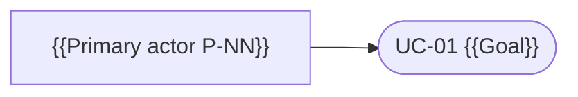

# {{product_or_scope}} — Use Case Registry

The registry of use cases for {{product_or_scope}}. Each row points to one `uc-NN-{slug}.md` file. A use case is the **actor↔system behavioural scenario** (all paths + guarantees) — it realises FBS functionalities and grounds PRDs; it is not a user story, an FBS row, or a UI spec.

Methodology (kit-only): `spec-use-case/references/methodology.md` — Cockburn textual use cases + UML diagrams + Jacobson Use-Case 2.0.

**Levels:** 🌊 user-goal (default) · ☁🪁 summary · 🐟🦪 subfunction. **Status:** ⬜ draft · 🔄 in progress · ✅ stable.

## Use Cases

| ID | Use case (goal) | Level | Scope | Primary actor | Realises (FBS) | Status |
|---|---|---|---|---|---|---|
| UC-01 | {{Goal verb phrase}} | 🌊 | system | {{P-NN}} | {{C-N.M.FXX}} | ⬜ |

## Actor / use-case overview (optional)

_Optional UML-style overview — an at-a-glance map of actors → goals. Keep it small (≤ ~20 use cases); the text files are the contract, this is only a map. Mermaid example:_

## Open Items

_Schema + lifecycle: `rules/open-items-governance.md`._

_None at present._
