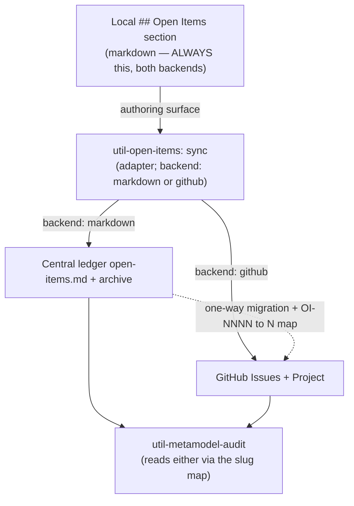
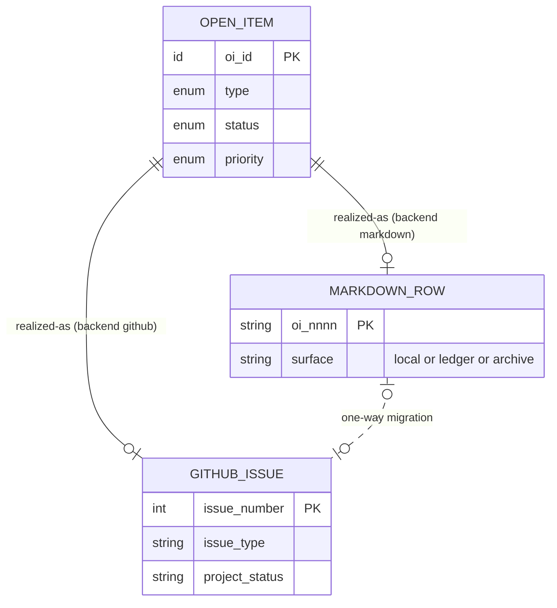

# Open Items — GitHub Backend Reference

Operational reference for the `github` backend of `util-open-items`. This file travels with
the skill (symlinked into `~/.claude/skills/`), so it is available to every project that
selects the backend **without ever being copied into a project's `docs/`**.

## Authority boundary

- **`rules/open-items-governance.md` owns the abstract model** — the §4 schema, §2 taxonomy,
  §3 lifecycle, and the §5.3 backend abstraction + invariants. It is backend-independent and
  user-global.
- **This reference owns the `github` serialization** — how the abstract model maps onto
  GitHub primitives, the status decomposition, and the one-way migration mechanics.
- **No project `docs/` file owns any of it.** A project's `docs/project-control/open-items/`
  holds the live `markdown` ledger (if that backend is used) and nothing about the model
  itself.

Where this file and the rule conflict on taxonomy / lifecycle / schema, the rule wins; this
file is authoritative only for the `github` mapping.

## Scope

Per `adr-0002`, the `github` backend is adopted for the **kit repo only** (dogfood before
generalising). Other projects use the default `markdown` backend. `OI-0030` decides whether
to generalise.

---

## 1. Canonical field slugs (the binding contract)

The rule's §4 columns each have a **stable slug** (lower-snake). The slug — not the column
header, not a UI label — is what every backend binds to. The audit reads any backend through
this one slug set.

```text
oi_id · type · summary · source_artefact · source_anchor ·
source_heading · resolution_path · priority · status · owner ·
review_date · tracker_ref
```

| Slug | §4 column | Domain |
| :--- | :--- | :--- |
| `oi_id` | OI-ID | identity (realized per backend — §3) |
| `type` | Type | `doc-gap` · `decision-gap` · `execution-item` · `tech-debt` |
| `summary` | Summary | one self-contained sentence |
| `source_artefact` | Source artefact | repo path \| scope marker \| empty |
| `source_anchor` | Source anchor | `#…` \| empty |
| `source_heading` | Source heading | string \| `_central-only_` |
| `resolution_path` | Resolution path | string |
| `priority` | Priority | `low` · `medium` · `high` · `critical` |
| `status` | Status | `open` · `in-progress` · `blocked` · `closed` · `dropped` |
| `owner` | Owner | string \| `_TBD_` |
| `review_date` | Due / Review date | ISO-8601 |
| `tracker_ref` | Tracker ref | URL \| `_TBD_` (non-`_TBD_` required for terminal) |

**Field partition** — drives the mapping below:

- **Authoring-time** (`type`, `summary`, `source_*`, `resolution_path`, `priority`) → Issue
  Type, title, and the **Issue Form**.
- **Lifecycle** (`status`, `owner`, `review_date`, `tracker_ref`, `oi_id`) → **native GitHub
  primitives**. Never hand-typed into a body — which is why github closure is structurally
  enforced.

---

## 2. GitHub serialization

The local `## Open Items` section stays §4 markdown (rule §1) regardless of backend; only the
central read-out changes. One `OpenItem` ⇒ one **Issue**, projected into one **Project**.

| Canonical slug | GitHub home | Mechanism |
| :--- | :--- | :--- |
| `oi_id` | Issue **number** `#N` | native; `OI-NNNN` retired in this backend |
| `type` | **Issue Type** | 4 types map 1:1 to the taxonomy |
| `summary` | Issue **title** | |
| `source_artefact` | Issue Form field `source_artefact` | `input` |
| `source_anchor` | Issue Form field `source_anchor` | `input` |
| `source_heading` | Issue Form field `source_heading` | `input` (or `_central-only_`) |
| `resolution_path` | Issue Form field `resolution_path` | `textarea` |
| `priority` | **Project** single-select field | sortable / groupable |
| `status` | Issue state **+** Project Status field **+** close reason | composite (§4) |
| `owner` | **Assignee** | native |
| `review_date` | **Project** date field / Milestone | |
| `tracker_ref` | **Closing reference** (`Closes #N`, linked PR) | native; unfakeable |
| read-out | **Project (v2) board view** | replaces `report`-mode table |
| archive | **Closed issues** (searchable indefinitely) | `archive` mode is a no-op here |

The **Issue Form** (`.github/ISSUE_TEMPLATE/open-item.yml`) carries only the authoring-time
partition; the lifecycle partition is native GitHub.

---

## 3. Interoperability

### 3a. Field-slug map (Invariant I1)

Issue-Form field `id:` ≡ canonical slug (e.g. `id: source_heading`, not `id: heading`). This
is what lets `util-metamodel-audit` parse an issue body exactly as it parses a ledger row.

### 3b. Identity translation (Invariant I2)

| | `markdown` | `github` |
| :--- | :--- | :--- |
| identity | `OI-NNNN` (minted) | `#N` (issue number) |
| ID space | independent | independent |

Migration is **`markdown → github` only**, performed once at adoption, and **must** emit a
persisted `OI-NNNN → #N` map so existing back-references (artefact body text; any
`tracker_ref` pointing at an old `OI-ID`) can be rewritten. No bidirectional or live sync —
two writers over two ID spaces is the dual-source-of-truth anti-pattern. A project runs
exactly one backend.

The migration is operated by **Mode 7 (`migrate`)** in `SKILL.md`, driven by
`scripts/migrate_markdown_to_github.py` (dry-run by default). It writes the map to
`docs/project-control/open-items/migration-map.md` and rewrites `OI-NNNN` back-references to
`#N` across the docs tree.

### 3c. Status decomposition (Invariant I3)

| Canonical `status` | Issue state | Project Status field | Close reason |
| :--- | :--- | :--- | :--- |
| `open` | open | (unset / "Open") | — |
| `in-progress` | open | "In progress" | — |
| `blocked` | open | "Blocked" | — |
| `closed` | closed | — | completed |
| `dropped` | closed | — | **not planned** |

`closed` / `dropped` require a non-`_TBD_` `tracker_ref` — automatic on `github` (you close
*via* a reference); validated by `util-open-items` on `markdown`.

---

## 4. Invariants

- **I1** — Issue-Form `id:` keys ≡ canonical slugs ≡ markdown column meanings. One field map,
  both backends.
- **I2** — Migration is one-way (`markdown → github`), once, with a persisted ID map; never
  concurrent. One backend per project.
- **I3** — Terminal status requires evidence (`tracker_ref`); native on `github`, validated
  on `markdown`.
- **I4** — The local `## Open Items` section is backend-invariant: always §4 markdown, so
  switching backends never touches authoring surfaces — only what `sync` writes to.
- **I5** — Provenance is the same composite in both backends; central-only items are
  `_central-only_` heading + empty anchor in both.

---

## 5. Diagrams





Each `OpenItem` is realized in exactly one backend per project; the two `realized-as`
relationships are mutually exclusive, enforced by the `backend:` setting, not the schema.

---

## See also

- `rules/open-items-governance.md` §4–§5 — the abstract model + backend abstraction (owner).
- `util-open-items/references/template.md` — the `markdown`-backend ledger skeleton.
- `adr-0002` (in a consuming repo's `docs/architecture/decisions/`, e.g. the kit) — the
  decision this mapping implements.
